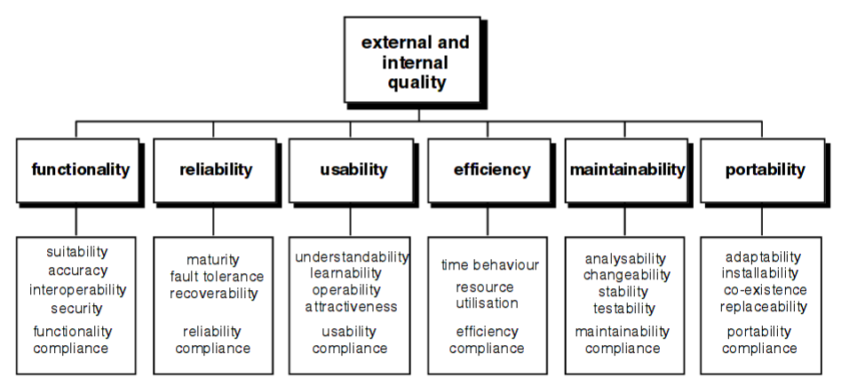

# Anforderungsspezifikation

## Korrektur-Prozess

Eine Prüfung durchläuft während der Korrektur verschiedene Zustände. Nach dem Import der Prüfungsdaten ist eine Prüfung in der Korrekturphase. Hier müssen alle Aufgaben korrigiert werden.

Sind alle Aufgaben korrigiert, so kann die Prüfung manuell in den nächsten Zustand, Review, überführt werden. Diese Phase läuft analog zur Korrektur ab, wobei der Reviewer bestehende Korrekturen anpassen und kommentieren kann. 

Ist ein Review abgeschlossen (manueller Schritt), so muss der Korrektor diese Reviews wiederum annehmen oder ablehnen. Diese Phase nennt sich Approval. Aufgaben, welche im Review weder kommentiert noch korrigiert wurden, sind automatisch approved. 

Sind alle Aufgaben approved, wird die Prüfung manuell in den Zustand appeal gesetzt. In dieser Phase verweilt eine Prüfung solange, bis die Rekursfrist abgelaufen oder ein allfälliger Rekurs abgeschlossen ist. Anschliessend wird eine Prüfung automatisch archiviert.

## Unterstützte Aufgabentypen
In einer ersten Phase unterstützen wir nur Textaufgaben. Diese haben eine textuelle Beschreibung und Antwort. In einer zweiten Phase (bei genügend Zeit oder nicht mehr im Rahmen des Engineering-Projekts) kommt der Aufgabentyp Multiple-Choice hinzu. Potentielle weitere Aufgabentypen (Bsp. mit Bildern oder Programmieraufgaben) müssen mit den Dozenten abgeklärt werden.

## Nicht-funktionale Anforderungen

Die nicht-funktionalen Anforderungen sind in den folgenden Kapiteln gemäss ISO 9126 gruppiert.

<figure>

<figcaption>Quality-Modell Framework gemäss <a href="http://www.cse.unsw.edu.au/~cs3710/PMmaterials/Resources/9126-1%20Standard.pdf">ISO 9126</a></figcaption>
</figure>

Im Rahmen des Engineering-Projekts können nicht alle nicht-funktionalen Anforderungen komplett umgesetzt werden, da dies den Zeitrahmen sprengen würde.
Alle aufgelisteten nicht-funktionalen Anforderungen wurden beim Design beachtet. Im Engineering-Projekt werden aber nur die fett-markierten Anforderungen komplett umgesetzt.

### Funktionalität (Functionality)

1. **Während der Korrektur müssen alle Prüfungen anonym/pseudonym sein, damit Sympathie, Hautfarbe, Geschlecht oder Herkunft von Studierenden keinen Einfluss auf die Noten haben.** (suitability)
2. **Die resultierenden Note muss auf 2 Nachkommastellen genau angegeben und mathematisch auf bzw. abgerundet werden.** (accuracy)
3. **Die Berechnung der resultierenden Note muss genau aufgeschlüsselt dargestellt werden, damit deren Berechnung nachvollzogen werden kann.**  (accuracy)
4. **Es müssen weitere Notensysteme innerhalb von 5 Arbeitstagen integriert werden können, um das Produkt auch im Ausland vertreiben zu können.** (interoperability)
5. **Die Anbindung an eine andere Datenbank-Schnittstelle muss innerhalb von 10 Tagen realisiert werden können.** (interoperability)
6. **Änderungen an Noten und Korrekturen müssen immer mit Autor, Datum und getätigten Änderungen protokolliert werden, damit die Korrektur stets nachvollzogen werden kann.** (security)
7. **Review-Kommentare dürfen nicht für alle Benutzer (Bsp. Studenten) einsehbar sein, da diese nur dem internen Austausch im Review-Prozess dienen.** (security)
8. **Das System darf keine Passwörter speichern. Die Authentifizierung und Autorisierung erfolgt ausschliesslich über Drittsysteme (Bsp. LDAP), damit die Passwörter zentral verwaltet und abgesichert werden.** (security)
9. Bestehende Infrastruktur für Authentifizierung und Autorisierung (LDAP) muss ohne den Zwang, neue Gruppen zu definieren, verwendet werden können. (interoperability)
10. Die resultierenden Noten müssen über eine API exportiert werden können, damit die Anwendung mit bestehenden Systemen (Bsp. Adunis) kombiniert werden kann.  (interoperability)
11. Die Noten müssen beim Export signiert werden, damit deren Echtheit und Integrität verifiziert werden kann. (security)
12. Sämtliche Daten dürfen nur über verschlüsselte Verbindungen übertragen werden, die minimal den [Empfehlungen und Schlüssellängen des BSI (BSI TR-02102-1, Version 2017-01)](https://www.bsi.bund.de/SharedDocs/Downloads/DE/BSI/Publikationen/TechnischeRichtlinien/TR02102/BSI-TR-02102.pdf;jsessionid=D931A7BAEAA3051CEC548F944E39CA15.1_cid360?__blob=publicationFile&v=3) entsprechen. (security)
13. Die Daten müssen gemäss [DSG Art. 7](https://www.admin.ch/opc/de/classified-compilation/19920153/index.html#a7) vor unbefugtem Zugriff geschützt sein. (security)
14. Manipulationen auf der Datenbank müssen automatisch erkannt werden, um Manipulation über den Direktzugriff auf die Datenbank zu verhindern. (security)
15. Die digitale Archivierung muss gemäss dem [Reglement der HSR (Stand 15. Dezember 2016)](https://www.hsr.ch/index.php?eID=tx_nawsecuredl&u=0&g=0&t=1489320430&hash=f9d9dba4e0bff31b13f5819829b710d15dc25654&file=fileadmin/user_upload/customers/hsr/HSR-INTERN/Schulleitung/Reglemente/BSc_Pruefungsreglement_Neuausgabe_15._Dezember_2016.pdf) erfolgen. (compliance)

## Zuverlässigkeit (Reliability)

1. **Die Integrität der Daten darf ausnahmslos nie verletzt werden, da Prüfungen Dokumente mit rechtlicher Bindung sind.** (maturity, fault tolerance)
2. **Bei einem kompletten Systemausfall muss das Gesamtsystem innerhalb von 24 Stunden von einer Person wiederhergestellt werden können.** (recoverability)
3. **Ausnahmefehler dürfen das System nicht zum Absturz bringen.** (fault tolerance)
4. Bei kritschen Fehlern, wie beispielsweise fehlender Speicherplatz, wird die Systemadministration umgehend informiert und den Benutzern eine verständliche Meldung angezeigt. (fault tolerance)
5. 99% Verfügbarkeit während der Korrekturphase, da eine Prüfungskorrektur sonst nicht möglich ist. (maturity)
6. 200 oder mehr Nutzer (skalierbar) müssen die Anwendung gleichzeitig nutzen können, da die Prüfungskorrektur nur zweimal jährlich im gleichen Zeitraum stattfindet.

## Benutzbarkeit (Usability)
1. **Für den Korrektor muss nach der Anmeldung sofort ersichtlich sein, welche Aufgaben seine Aufmerksamkeit erfordern.** (understandability)
2. **Für das Verständnis der Bedienung der Anwendung muss nur der Ablauf des Prüfungsprozesses bekannt sein.** (learnability)
3. **Zu jedem Zeitpunkt muss der Benutzer effizient Hilfe im Handbuch finden können (Bsp. Name der Aktivität gut sichtbar und Benutzerdokumentation nach Aktivitäten aufgebaut).** (learnability)
4. **Für das ganze System muss ein einheitliches Stylesheet verwendet werden.** (operability)
5. Ein Hilfe-Button zeigt zu jeder Aktivität einen Link an die entsprechende Stelle der Benutzerdokumentation. (learnability)
6. Vorgenommene Korrekturen werden zwischengespeichert, damit beispielsweise bei einem Browser-Absturz nicht die Arbeit von >1 Minute verloren geht.

## Effizienz (Efficiency)
1. Das System muss innerhalb von max. 0.5 Sekunden nach Starten der Aktion durch den Nutzer antworten, auch wenn 200 Nutzer die Anwendung parallel verwenden. (time behaviour)

## Änderbarkeit (Maintainability)
1. **Jede Änderung an einer Korrektur muss protokolliert werden.** (analysability)
2. **Alle Fehler müssen automatisch protokolliert werden.** (analysability)
3. **Dynamische Konfigurationen von Prüfungsreglementen / Modulstrukturen für andere Hochschulen müssen innerhalb von 30 Arbeitstagen eingefügt werden können.** (changability)
4. **Neue Prüfungsaufgabentypen (Bsp. Multiple-Choice) müssen innerhalb von 10 Arbeitstagen eingeführt werden können.**
5. **Die Business-Logik und alle Use-Cases müssen mit automatischen Unit-Tests abgedeckt sein**. (testability)
6. **Alle Use-Cases des Web-Interfaces müssen über automatische Browser-Tests abgedeckt sein**. (testability)
7. Automatische Updates müssen ohne manuelles Eingreifen eingespielt werden können (stability)

## Übertragbarkeit (Portability)
1. **Das System muss auch als Docker-Image ausgeliefert werden, um eine schnelle Installation zu ermöglichen.** (installability)
2. **Das System verwendet keine proprietären Datenbankfunktionen, um deren Austauschbarkeit zu gewährleisten.** (comformance)
3. Die Software muss auf Linux und Windows-Servern deployed werden können. (adaptability)
4. Die Daten müssen in einem Format vorgehalten bzw. exportiert werden, welches auch von anderen Systemen gelesen werden kann (Bsp. JSON/CSV). (replaceability)
