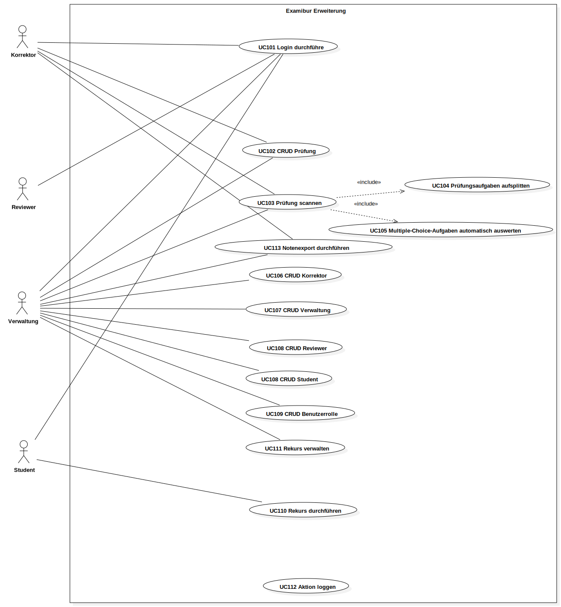

# Einführung

## Zweck
Dieses Dokument beschreibt die Anforderungsspezifikation. Es wird der Fokus auf die funktionalen Anforderungen gelegt. Es ist ersichtlich, welche Use Cases Scope des Projekts sind und welche Use Cases für Folgeprojekte vorgesehen sind. Desweiteren werden die Stakeholders analysiert und ihre Anspruche mit User Stories indentifiziert.

## Gültigkeitsbereich
Der Gültigkeitsbereich beschränkt sich auf die Projektdauer vom 20.02.17 bis 02.06.17. Während dieser Zeit wird das Dokument laufend aktualisiert und stellt zu jedem Zeitpunkt einen genauen Überblick über die Anforderungsspezifikation zur Verfügung.

## Referenzen
In der nachfolgenden Tabelle sind alle Dokumente und Links aufgelistet, welche für die Anforderungsspezifikation von Relevanz sind. Diese Liste wird laufend auf dem aktuellen Stand gehalten.

| **Name**                          | **Referenz**                                                                                                                                                                                                                                         |
| --------------------------------- | ----------------------------- |
|                      |

## Übersicht
`TODO`

# Allgemeine Beschreibung
`TODO`

## Einschränkungen
`TODO`

## Abhängigkeiten
`TODO`

# Funktionale Anforderungen

## Einschränkungen
Die Beschreibung der folgenden Kapitel wurde basierend auf der Vision von Examibur erfasst. Im Unterkapitel Use Cases ist klar ersichtlich, welche Funktionalität Scope des Projekts Examibur ist. Um die Applikation offen für folge Projekte zu halten, wurden die anderen Anforderungen zustätzlich spezifiziert (im Brief-Format), um sich keine Hindernisse einzubauen, welche eine allfällige Erweiterung erschweren könnten.

## Aktoren

| Aktor                         | Beschreibung  |
|-------------------------------|---------------|
| **Korrektor**                 | Ein Korrektor erstellt und verwaltet Prüfungen. Nach Durchführung einer Prüfung hat er die Möglichkeit die Prüfungen mit einem Scanner in das System zu spielen. Sobald die Prüfungen im System erfasst und verarbeitet wurden, kann er gleiche Prüfungsaufgaben einzeln durchgehen und korrigieren. Der Korrektor kann auch eine Prüfung eines Studenten ganz durchkorrigieren. Sind alle Aufgaben korrigiert, kann die Prüfung in den Reviewprozess übergeben werden. Aufgabenbewertungen, welche vom Reviewer zurückgewiesen werden, müssen überarbeitet werden, bevor die Prüfung in den Status korrigiert überführt werden kann. |
| **Reviewer**                  | Sobald der Korrektor eine Prüfung einem Reviewer zuordnet, kann der Reviewer Aufgabe für Aufgabe durchgehen und die Aufgabenwertungen des Korrektor überprüfen, welche er akzeptieren kann oder per Kommentar an den Korrektor korrigiert zurückweisen kann.	|
| **Verwaltung**                | Die Verwaltung der Lehranstalt erstellt initiale Prüfungen mit allen Terminen und weist diese den Korrektoren zur Erstellung der Prüfung zu. Die Verwaltung kann den Status der einzelnen Prüfung einsehen und hat die Möglichkeit die korrigierten Prüfung nach Abschluss der Reviewphase einzusehen und bei Bedarf zu exportieren. Falls ein Student den Rekursprozess startet, übernimmt die Verwaltung die Verabeitung dieses Rekurses. 	|
| **Student**                   | Der Student hat die Möglichkeit die korrigierte Prüfung nach Freischaltung der Noten einzusehen und bei Ungereinheimten den Rekursprozess anzustossen.  	|

## Stakeholder

Die Ansprüche der Stakeholder werden als Uses Stories erfasst, um so den Sinn und Zweck von Examibur und den Mehrwert für alle Stakeholder aufzuzeigen.

### Lehranstalt
#### _US101: Qualitätssicherung_

Als Lehranstalt möchte ich die Qualität der Prüfungskorrekturen hochhalten, um Rekurskosten zu sparen.

#### _US102: Rekurszprozess_

Als Lehranstalt möchte ich den Rekursprozess abgebildet haben, um so die rechtlichen Vorgaben einhalten zu können.

### Dozent
#### _US201: Prüfung erstellen_

Als Dozent möchte ich Prüfungen online erstellen können, um so eine einfache, zentrale und für Nachfolge transparente Ablage der Prüfung zu erreichen.

#### _US202: Qualität aufrechterhalten_

Als Dozent möchte ich Prüfungskorrekturen reviewen lassen, um so die Qualität und Fairness der Bewertungen aufrecht zu halten und allfällige Flücktigkeitsfehler zu vermeiden.

#### _US203: Prüfung online korrigieren_

Als Dozent möchte ich Prüfungen online korrigieren, um so den Papierkrieg einzudämmen, Verluste vorzubeugen und Transparenz zu gewährleisten.

### Student
#### _US301: anoynme Korrektur_

Als Student möchte ich einen anonyme Korrektur der Prüfung erhalten, um so eine faire Beurteilung aller Studenten sicherzustellen.

#### _US302: Prüfungsreview_

Als Student möchte ich eine zweite Beurteilung der Korrektur nach dem 4-Augen-Prinzip, um so die Qualität der Korrekturen hoch und fair zu halten.

#### _US303: Prüfungseinsicht_

Als Student möchte ich die Prüfung inklusiv Korrektur nach Freischaltung der Noten einsehen, um so das Zustandkommen der Note zu verstehen und um Wissenslücken am Ende des Moduls zu identifizieren.

#### _US304: Rekursprozess_

Als Student möchte ich den Rekursprozess bei Ungereinheimten anstossen, um so alle Fristen und Bedingungen für einen gültigen Rekurs einhalten zu können.

## Use Cases

### Diagramm

### Beschreibung

Im folgenden sind alle Use Cases im fully dressed-Format aufgelistet, welche Teil des Scopes des Projekts sind.

#### _UC001: Prüfungen anzeigen_
**Primary Actor:** Korrektor, Verwaltung

**Stakeholders and Interests:**

- _Korrektor_ will alle Prüfungen sehen, welche ihm zugewiesen sind, um Korrekturen durchführen zu können.
- _Reviewer_ will alle Prüfungen sehen, welche ihm zum Review zugewiesen sind, um den Review durchführen zu können.
- _Verwaltung_ will alle Prüfungen sehen, um Metadaten (Durchführungsdatum, etc.) bearbeiten und um Notenexporte durchführen zu können.

**Preconditions:**

- Der User ist im System angemeldet.

**Postconditions:**

- Dem _Korrektor_ werden seine zugewiesene Prüfungen angezeigt.
- Dem _Reviewer_ werden zum Review zugewiesene Prüfungen angezeigt.
- Der _Verwaltung_ wird alle Prüfungen angezeigt.

**Main Success Scenario:**

1. Der User öffnet die Übersicht/Dashboard.
2. Das System lädt alle relevanten Prüfungen.

#### _UC002: Prüfung öffnen_

**Primary Actor:** Korrektor

**Stakeholders and Interests:**

- _Korrektor_ will eine Prüfung öffnen, um Prüfungsdurchführungen korrigieren zu können.

**Preconditions:**

- Der User ist im System angemeldet und befindet sich auf der Übersicht/Dashboard.
- Die Prüfung ist dem User zugewiesen.

**Postconditions:**

- Dem User wird die Prüfung zur Korrektur angezeigt.

**Main Success Scenario:**

1. Der User wählt aus der Prüfungsliste eine Prüfung aus.
2. Das System lädt die Prüfung.

**Level:**

include:

 - UC003
 - UC007

#### _UC003: Prüfungsteilnahmen anzeigen_
**Primary Actor:** Korrektor, Verwaltung

**Stakeholders and Interests:**

- _Korrektor_ will alle Prüfungsteilnahmen sehen, um Prüfungsteilnahmen einzeln korregieren zu können.
- _Verwaltung_ will alle Prüfungsteilnahmen sehen, um Prüfungsteilnahmen an Studenten freigeben und um Notenexporte über alle Prüfungsteilnahmen durchführen zu können.

**Preconditions:**

- Der User ist im System angemeldet und hat die Prüfung geöffnet.

**Postconditions:**

- Dem User werden alle Prüfungsteilnahmen zur Prüfung angezeigt.

**Main Success Scenario:**

1. Das System lädt alle Prüfungsteilnahmen.

#### _UC004: Prüfungsaufgaben anzeigen_
**Primary Actor:** Korrektor, Verwaltung

**Stakeholders and Interests:**

- _Korrektor_ will alle Prüfungsaufgaben sehen, um alle Lösungen zu einer Prüfungsaufgaben korrigieren zu können.

**Preconditions:**

- Der User ist im System angemeldet und hat die Prüfung geöffnet.

**Postconditions:**

- Dem User werden alle Prüfungsaufgaben zur Prüfung angezeigt.

**Main Success Scenario:**

1. Das System lädt alle Prüfungsaufgaben.

#### _UC005: Prüfungsteilnahme korrigieren_
`TODO`

**Level:**

include:

 - UC007

#### _UC006: Prüfungsaufgabe korrigieren_
`TODO`

**Level:**

include:

 - UC007

#### _UC007: Aufgabe korrigieren_
`TODO`

#### _UC008: Prüfung für Review freigeben_
`TODO`

#### _UC009: Prüfungsreviews anzeigen_
`TODO`

#### _UC010: Prüfungsreview öffnen_

**Primary Actor:** Reviewer

**Stakeholders and Interests:**

- _Reviewer_ will eine Prüfung öffnen, um den Review der Korrektur durchführen zu können.

**Preconditions:**

- Der User ist im System angemeldet und befindet sich auf der Übersicht/Dashboard.
- Die Prüfung ist dem User zugewiesen.

**Postconditions:**

- Dem User wird die Prüfung zum Review angezeigt.

**Main Success Scenario:**

1. Der User wählt aus der Prüfungsliste eine Prüfung aus.
2. Das System lädt die Prüfung.

**Level:**

include:

 - UC011
 - UC012

#### _UC011: Prüfungsteilnahme reviewen_
`TODO`

**Level:**

include:

 - UC013

#### _UC012: Prüfungsaufgabe reviewen_
`TODO`

**Level:**

include:

 - UC013

#### _UC013: Aufgabe reviewen_
`TODO`

#### _UC014: Prüfung zur Überarbeitung freigeben_
`TODO`

#### _UC016: Prüfungskorrektur abschliessen_
`TODO`

#### _UC017: Notenskala festlegen_
`TODO`

#### _UC018: Prüfung auswerten_
`TODO`

Statistik (Modul/Prüfungsebene/im Vergleich zu vorherigen Jahrgängen) über die Prüfungen dieser Moduldurchführung anzeigen

#### _UC019: ToDo's anzeigen_
`TODO`

#### _UC020: Prüfung zur Verwaltung anzeigen_
**Primary Actor:** Verwaltung

**Stakeholders and Interests:**

- _Verwaltung_ will eine Prüfung öffnen, um Metadaten zu verwalten, den Status der Prüfungsdurchführungen zu prüfen und Notenexporte durchführen zu können.

**Preconditions:**

- Der User ist im System angemeldet und befindet sich auf der Übersicht/Dashboard.
- Die Prüfung ist dem User zugewiesen.

**Postconditions:**

- Dem User wird die Prüfung zur Verwaltung angezeigt.

**Main Success Scenario:**

1. Der User wählt aus der Prüfungsliste eine Prüfung aus.
2.  Das System lädt die Prüfung.

**Level:**

include:

 - UC003

#### _UC021: Prüfungsteilnahme an Student freigeben_
`TODO`

#### _UC022: Notenexport durchführen_
`TODO`

Um eine einfache Migrierung in anderen Systeme zu gewährleisten

## Erweiterungen

Im folgenden werden Use Cases kurz aufgelistet, welche das Projekt in seiner Funktionalität vervollständigen würden, um die angestrebte Vision zu erreichen.
Diese Use Cases sind nicht Teil des Scopes und werden bei Bedarf und freier Zeit eingeplannt und umgesetzt.
Grundsätzlich sollen sie eine Übersicht für folge Projekte bieten und aufzeigen, was alles noch möglich sein könnte.

### Diagramm

### Beschreibung

### _UC101: Login durchführen_
`TODO`

### _UC101: Registrierung durchführen_
`TODO`

### _UC103: CRUD Prüfung_
`TODO`

darf auch Verwaltung

### _UC104: Prüfung scannen_
`TODO`

include UC105, UC106

### _UC105: Multiple-Choice-Aufgaben automatisch auswerten_
`TODO`

### _UC106: Prüfungsaufgaben aufsplitten_
`TODO`

### _UC108: CRUD Korrektor_
`TODO`

### _UC109: CRUD Verwalter_
`TODO`

### _UC110: CRUD Student_
`TODO`

### _UC111: CRUD Benutzerrolle_
`TODO`

### _UC112: Rekurs durchführen_
`TODO`

### _UC113: Rekurs verwalten_
`TODO`

### _UC114: Aktion loggen_
`TODO`

Historie über Änderungen an der Prüfung und Korrektur erstellen
