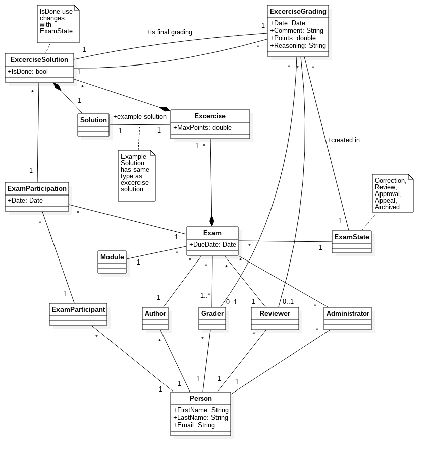

# Einführung

## Zweck
Dieses Dokument beschreibt die Domain-Analyse. Es dokumentiert das Domain Model anhand der Problem-Domain und ergänzt es mit Erläuterungen. Ausserdem wird der Prozess einer Prüfung von der Korrektur bis zur Archivierung beschrieben.

## Gültigkeitsbereich
Der Gültigkeitsbereich beschränkt sich auf die Projektdauer vom 20.02.17 bis 02.06.17. Während dieser Zeit wird das Dokument laufend aktualisiert und stellt zu jedem Zeitpunkt einen Überblick über die Problem-Domain zur Verfügung.

## Referenzen
In der nachfolgenden Tabelle sind alle Dokumente und Links aufgelistet, welche für die Domain-Analyse von Relevanz sind. Diese Liste wird laufend auf dem aktuellen Stand gehalten.

| **Name**                                  | **Referenz**                                                                                                                                                                                                                                         |
| ---------------------------------------- | ----------------------------- |
| Funktionale Anforderungen                | [Funktionale Anforderungen ](funktionaleAnforderungen.html) |
| Nicht-funktionale Anforderungen          | [Nicht-funktionale Anforderungen](nichtFunktionaleAnforderungen.html)

# Domain Model UML

## Erläuterungen
- Unter `Exam` versteht man eine Prüfungsdurchführung, für die es eine oder mehrere gelöste Prüfungen der Prüfungsteilnehmer gibt.
- Eine Prüfungsteilnahme (`ExcerciseParticipation`) ist eine gelöste Prüfung eines Prüfungsteilnehmers.
- Zu jeder gelösten Aufgabenstellung `ExerciseSolution` können mehrere Korrekturen (`ExcerciseGrading`) erstellt werden. Jede Aufgabe wird einem Korrektor und einem Reviewer zugeordnet. Zur Korrektur/Review kann ein Grund angegeben werden, der nur intern sichtbar ist (während der Kommentar auch dem Teilnehmer gezeigt wird). Am Schluss entscheidet der Korrektor, welche Punktzahl der Aufgabe die endgültige Bewertung ist (*final grading*). Bei jeder Aufgabenkorrektur wird mitgespeichert, in welcher Phase der Prüfungskorrektur (z.B. `Correction`, `Review`) und von wem diese vorgenommen wurde.
- Die Lösungen einer Prüfungsaufgabe können von verschiedenen Subtypen von `Solution` sein. Eine Prüfungsaufgabe hat genau eine Musterlösung. Diese muss vom gleichen (Sub-)Typ sein, wie die Lösungen der Prüfungsteilnehmer.
- Das Flag `isDone` bei einer Aufgabenlösung (`ExcerciseSolution`) wird bei jeder Phase des Prozesses neu gesetzt. In der Korrektur-Phase zum Beispiel zeigt es an, ob die Aufgabe bereits korrigiert wurde, während es in der Approval-Phase signalisiert, ob es einen Einwand des Reviewers gibt und dieser vom Korrektor bearbeitet werden muss. Aufgrund dieses Felds werden die "ToDo's" erstellt.

# Korrektur-Prozess

Eine Prüfung durchläuft während der Korrektur verschiedene Zustände. Nach dem Import der Prüfungsdaten ist eine Prüfung in der Korrekturphase. Hier müssen alle Aufgaben korrigiert werden.

Sind alle Aufgaben korrigiert, so kann die Prüfung manuell in den nächsten Zustand, Review, überführt werden. Diese Phase läuft analog zur Korrektur ab, wobei der Reviewer bestehende Korrekturen anpassen und kommentieren kann.

Ist ein Review abgeschlossen (manueller Schritt), so muss der Korrektor diese Reviews wiederum annehmen oder ablehnen. Diese Phase nennt sich Approval. Aufgaben, welche im Review weder kommentiert noch korrigiert wurden, sind automatisch approved.

Sind alle Aufgaben approved, wird die Prüfung manuell in den Zustand appeal gesetzt. In dieser Phase verweilt eine Prüfung solange, bis die Rekursfrist abgelaufen oder ein allfälliger Rekurs abgeschlossen ist. Anschliessend wird eine Prüfung automatisch archiviert.

## Unterstützte Aufgabentypen
In einer ersten Phase unterstützen wir nur Textaufgaben. Diese haben eine textuelle Beschreibung und Antwort. In einer zweiten Phase (bei genügend Zeit oder nicht mehr im Rahmen des Engineering-Projekts) kommt der Aufgabentyp Multiple-Choice hinzu. Potentielle weitere Aufgabentypen (Bsp. mit Bildern oder Programmieraufgaben) müssen mit den Dozenten abgeklärt werden.
