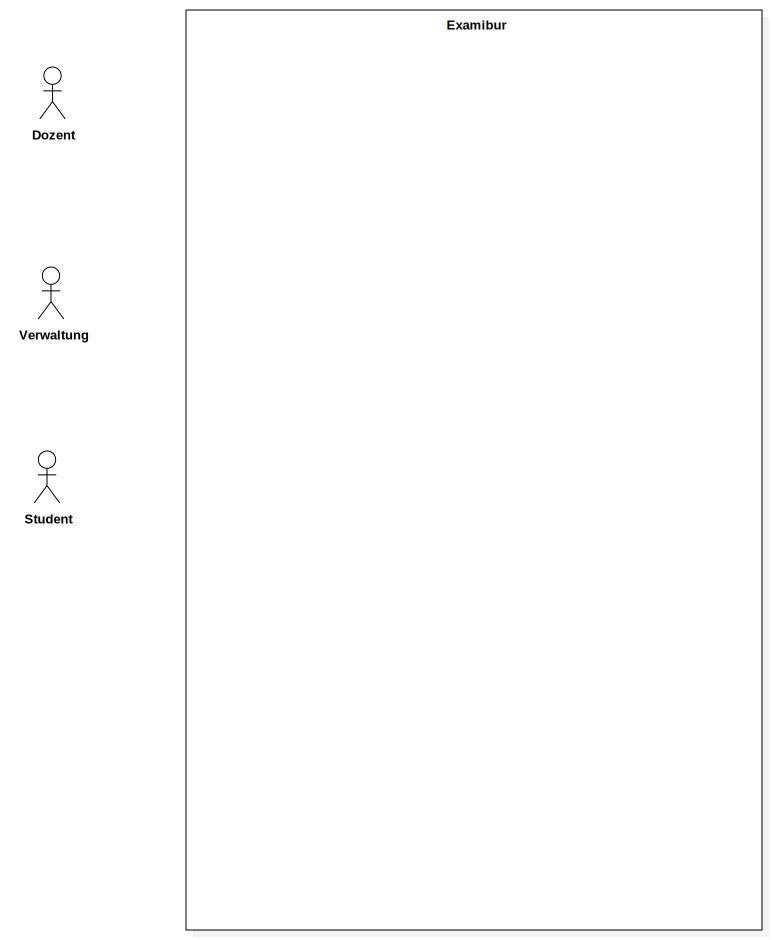
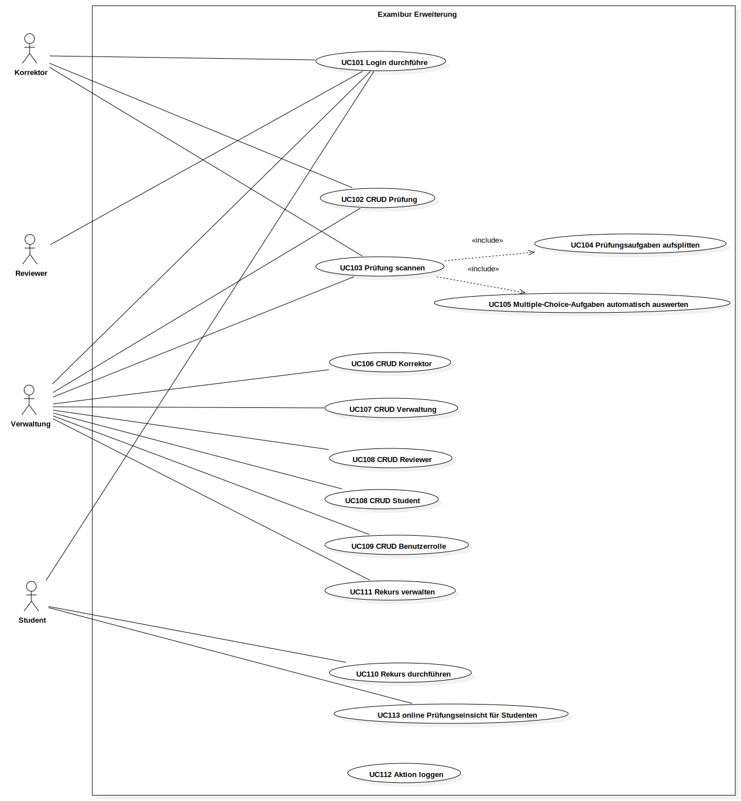

# Einführung

## Zweck
Dieses Dokument beschreibt die Anforderungsspezifikation. Es wird der Fokus auf die funktionalen Anforderungen gelegt. Es ist ersichtlich, welche Use Cases Scope des Engineering-Projekts sind und welche Use Cases für Folgeprojekte vorgesehen sind. Desweiteren werden die Stakeholders analysiert und ihre Ansprüche mit User Stories identifiziert. Aus Gründen der Übersichtlichkeit sind die nicht-funktionalen Anforderungen in einem [separaten Dokument](nichtFunktionaleAnforderungen.html) beschrieben.

## Gültigkeitsbereich
Der Gültigkeitsbereich beschränkt sich auf die Projektdauer vom 20.02.17 bis 02.06.17. Während dieser Zeit wird das Dokument laufend aktualisiert und stellt zu jedem Zeitpunkt einen genauen Überblick über die funktionalen Anforderungen zur Verfügung.

## Referenzen
In der nachfolgenden Tabelle sind alle Dokumente und Links aufgelistet, welche für die funktionalen Anforderungen von Relevanz sind. Diese Liste wird laufend auf dem aktuellen Stand gehalten.

| **Name**                          | **Referenz**                                                                                                                                                                                                                                         |
| --------------------------------- | ----------------------------- |
|  nicht-funktionale Anforderungen  | [nicht-funktionale Anforderungen ](nichtFunktionaleAnforderungen.html) |
|  Software Architektur             | [Software Architektur](../architektur/softwareArchitektur.html) |
|  Produkt & Vision                 | [Projektplan](../projektplan/projektplan.html)
|  Personas                         | [Personas](personas.html) |

# Allgemeine Beschreibung

## Produkt & Vision
Produkt & Vision können dem [Projektplan](../projektplan/projektplan.html) im Kapitel Projekt Übersicht entnommen werden.

## Zielgruppe
Die Zielgruppen des Projekts sind im Dokument [Personas](personas.html) genauer beschrieben.

## Abhängigkeiten
Die Nutzung von Examibur setzt einen aktuellen Webbrowser mit einer funktionierenden Internetverbindung voraus.

Examibur verwendet diverse Bibliotheken, Frameworks und Produkte, welche sich in der Praxis bewährt haben ([siehe Software Architektur](../architektur/softwareArchitektur.html)).

# Funktionale Anforderungen
Im folgenden sind die funktionalen Anforderungen anhand von Use Cases beschrieben. Es wird besonderen Wert auf die Aktoren und Stakeholder gelegt, um die Bedürfnisse der verschiedenen Anspruchsgrupppen an das Produkt zu identifizieren. Die Use Cases, welche im Scope des Projekts sind, sind im Fully-Dressed-Format aufgelistet. Use Cases für allfällige Folgeprojekte werden im Brief-Format spezifiziert.

## Einschränkungen
Die Beschreibung der folgenden Kapitel wurde basierend auf der Vision von Examibur erfasst. Im Unterkapitel Use Cases ist klar ersichtlich, welche Funktionalität Scope des Projekts Examibur ist. Um die Applikation offen für Folgeprojekte zu halten, wurden die anderen Anforderungen zusätzlich spezifiziert (Kapitel Erweiterungen), um sich keine Hindernisse einzubauen, welche eine allfällige Erweiterung erschweren könnten.

## Aktoren

| Aktor                         | Beschreibung  |
|-------------------------------|---------------|
| **Korrektor**                 | Ein Korrektor erstellt und verwaltet Prüfungen. Nach der Durchführung einer Prüfung hat er die Möglichkeit, die Prüfungen mit einem Scanner in das System einzulesen. Sobald die Prüfungen im System erfasst bzw. eingelesen wurden, kann er gleiche Prüfungsaufgaben einzeln durchgehen und korrigieren. Der Korrektor kann auch eine Prüfung eines einzelnen Studenten am Stück korrigieren. Sind alle Aufgaben korrigiert, kann die Prüfung in den Reviewprozess überführt werden. Aufgabenbewertungen, welche vom Reviewer zurückgewiesen werden, müssen überarbeitet werden, bevor die Prüfung in den Status _korrigiert_ überführt werden kann. |
| **Reviewer**                  | Sobald der Korrektor eine Prüfung einem Reviewer zuordnet, kann dieser Aufgabe für Aufgabe durchgehen und die Aufgabenwertungen des Korrektors überprüfen. Er kann sie entweder akzeptieren oder per Kommentar an den Korrektor zurückweisen.	|
| **Verwaltung**                | Die Verwaltung der Lehranstalt erstellt initiale Prüfungen mit allen Terminen und weist diese den Korrektoren zur Erstellung der Prüfung zu. Die Verwaltung kann den Status der einzelnen Prüfung einsehen und hat die Möglichkeit die korrigierten Prüfungen nach Abschluss der Reviewphase einzusehen und bei Bedarf zu exportieren. Falls ein Student den Rekursprozess startet, übernimmt die Verwaltung die Verarbeitung dieses Rekurses. 	|
| **Student**                   | Der Student hat die Möglichkeit die korrigierte Prüfung nach Freischaltung der Noten einzusehen und bei Bedarf den Rekursprozess anzustossen.  	|

## Stakeholder

Die Ansprüche der Stakeholder werden als User Stories erfasst, um so den Sinn und Zweck von Examibur und den Mehrwert für alle Stakeholder aufzuzeigen.

### Lehranstalt
#### _US101: Qualitätssicherung_

Als Lehranstalt möchte ich die Qualität der Prüfungskorrekturen hochhalten, um Rekurskosten zu sparen.

#### _US102: Rekurszprozess_

Als Lehranstalt möchte ich den Rekursprozess abgebildet haben, um so die rechtlichen Vorgaben einhalten zu können.

### Dozent
#### _US201: Prüfung erstellen_

Als Dozent möchte ich Prüfungen online erstellen können, um so eine einfache, zentrale und für Nachfolge transparente Ablage der Prüfung zu erreichen.

#### _US202: Qualität aufrechterhalten_

Als Dozent möchte ich Prüfungskorrekturen reviewen lassen, um so die Qualität und Fairness der Bewertungen aufrecht zu erhalten und allfällige Flüchtigkeitsfehler zu vermeiden.

#### _US203: Prüfung online korrigieren_

Als Dozent möchte ich Prüfungen online korrigieren, um so den Papierkrieg einzudämmen, Verluste vorzubeugen und Transparenz zu gewährleisten.

### Student
#### _US301: anonyme Korrektur_

Als Student möchte ich eine anonyme Korrektur der Prüfung erhalten, um so eine faire Beurteilung meiner Leistung sicherzustellen.

#### _US302: Prüfungsreview_

Als Student möchte ich eine zweite Beurteilung der Korrektur nach dem 4-Augen-Prinzip, um so die Qualität der Korrekturen hoch und fair zu halten.

#### _US303: Prüfungseinsicht_

Als Student möchte ich die Prüfung inklusive Korrektur nach Freischaltung der Noten einsehen, um so das Zustandekommen der Note zu verstehen und um Wissenslücken am Ende des Moduls zu identifizieren.

#### _US304: Rekursprozess_

Als Student möchte ich den Rekursprozess bei Ungereimtheiten anstossen, um so alle Fristen und Bedingungen für einen gültigen Rekurs einhalten zu können.

## Use Cases

### Diagramm

### Beschreibung

Im folgenden sind alle Use Cases im Fully-Dressed-Format aufgelistet, welche Teil des Scopes des Projekts sind.

#### _UC001: Prüfungen anzeigen_
**Primary Actor:** Korrektor, Reviewer, Verwaltung

**Stakeholders and Interests:**

- _Korrektor_ will alle Prüfungen sehen, welche ihm zugewiesen sind, um Korrekturen durchführen zu können.
- _Reviewer_ will alle Prüfungen sehen, welche ihm zum Review zugewiesen sind, um den Review durchführen zu können.
- _Verwaltung_ will alle Prüfungen sehen, um Metadaten (Durchführungsdatum, etc.) bearbeiten und um Notenexporte durchführen zu können.

**Preconditions:**

- Der User ist im System angemeldet.

**Postconditions:**

- Dem _Korrektor_ werden seine zugewiesene Prüfungen angezeigt.
- Dem _Reviewer_ werden zum Review zugewiesene Prüfungen angezeigt.
- Der _Verwaltung_ werden alle Prüfungen angezeigt.

**Main Success Scenario:**

1. Der User öffnet die Übersicht/Dashboard.
2. Das System lädt alle relevanten Prüfungen.

#### _UC002: Prüfung öffnen_

**Primary Actor:** Korrektor, Reviewer, Verwaltung

**Stakeholders and Interests:**

- _Korrektor_ will eine Prüfung öffnen, um Prüfungsdurchführungen korrigieren zu können.
- _Reviewer_ will eine Prüfung öffnen, um den Review der Korrektur durchführen zu können.
- _Verwaltung_ will eine Prüfung öffnen, um Prüfungsteilnahmen an _Studenten_ freigeben zu können.

**Preconditions:**

- Der User ist im System angemeldet und befindet sich auf der Übersicht/Dashboard.
- Die Prüfung ist dem User zugewiesen.

**Postconditions:**

- Dem User wird die Prüfung zur weiteren Verarbeitung (Korrektur, Review, Export, Auswertung) angezeigt.

**Main Success Scenario:**

1. Der User wählt aus der Prüfungsliste eine Prüfung aus.
2. Das System lädt die Prüfung.

**Level:**

include:

 - UC003
 - UC004
 - UC018

#### _UC003: Prüfungsteilnahmen anzeigen_
**Primary Actor:** Korrektor, Reviewer, Verwaltung

**Stakeholders and Interests:**

- _Korrektor_ will alle Prüfungsteilnahmen sehen, um Prüfungsteilnahmen einzeln korrigieren zu können.
- _Reviewer_ will alle Prüfungsteilnahmen sehen, um Prüfungsteilnahmen einzeln reviewen zu können.
- _Verwaltung_ will alle Prüfungsteilnahmen sehen, um Prüfungsteilnahmen an Studenten freigeben und um Notenexporte über alle Prüfungsteilnahmen durchführen zu können.

**Preconditions:**

- Der User ist im System angemeldet und hat eine Prüfung geöffnet.

**Postconditions:**

- Dem User werden alle Prüfungsteilnahmen zur Prüfung angezeigt.

**Main Success Scenario:**

1. Das System lädt alle Prüfungsteilnahmen.

#### _UC004: Prüfungsaufgaben anzeigen_
**Primary Actor:** Korrektor, Reviewer

**Stakeholders and Interests:**

- _Korrektor_ will alle Prüfungsaufgaben sehen, um alle Lösungen zu einer Prüfungsaufgaben korrigieren zu können.
- _Reviewer_ will alle Prüfungsaufgaben sehen, um alle Bewertungen zu einer Prüfungsaufgabe reviewen zu können.

**Preconditions:**

- Der User ist im System angemeldet und hat eine Prüfung geöffnet.

**Postconditions:**

- Dem User werden alle Prüfungsaufgaben zur Prüfung angezeigt.

**Main Success Scenario:**

1. Das System lädt alle Prüfungsaufgaben.

#### _UC005: Prüfungsteilnahme korrigieren_
**Primary Actor:** Korrektor

**Stakeholders and Interests:**

- _Korrektor_ will eine Prüfungsteilnahme eines Studenten Aufgabe für Aufgabe korrigieren.

**Preconditions:**

- Der User ist im System angemeldet und hat die Prüfung geöffnet.

**Postconditions:**

- Dem User wurden alle gelöste Aufgaben eines Prüfungsteilnehmers zur Korrektur angezeigt, welche vom User korrigiert wurden.

**Main Success Scenario:**

1. Der User wählt aus der Liste aller Prüfungsteilnahmen eine aus und öffnet sie.
2. UC007 durchführen.
Wiederhole 2 bis alle Aufgaben korrigiert sind

**Level:**

include:

 - UC007

#### _UC006: Prüfungsaufgabe korrigieren_
**Primary Actor:** Korrektor

**Stakeholders and Interests:**

- _Korrektor_ will alle Lösungen aller Teilnehmer einer Aufgabe korrigieren.

**Preconditions:**

- Der User ist im System angemeldet und hat die Prüfung geöffnet.

**Postconditions:**

- Dem User wurden alle gelöste Aufgaben einer Aufgabe aller Prüfungsteilnehmer zur Korrektur angezeigt, welche vom User korrigiert wurden.

**Main Success Scenario:**

1. Der User wählt aus der Liste aller Prüfungsaufgaben eine aus und öffnet sie.
2. UC007 durchführen.
Wiederhole 2 bis alle Aufgaben korrigiert sind

**Level:**

include:

 - UC007

#### _UC007: Aufgabe korrigieren_
**Primary Actor:** Korrektor

**Stakeholders and Interests:**

- _Korrektor_ will eine gelöste Prüfungsaufgabe eines Teilnehmers korrigieren.

**Preconditions:**

- Der User ist im System angemeldet und kommt über UC005 oder UC006.

**Postconditions:**

- Der User hat die Aufgabe korrigiert.

**Main Success Scenario:**

1. Das System lädt die Aufgabe.
2. Der User korrigiert die Aufgabe, fügt einen Kommentar hinzu, bewertet sie und drückt auf nächste Aufgabe korrigieren.

#### _UC008: Prüfung für Review freigeben_
**Primary Actor:** Korrektor

**Stakeholders and Interests:**

- _Korrektor_ will nach der Korrektur die Prüfung für den Review freigeben.

**Preconditions:**

- Der User ist im System angemeldet und hat alle Prüfungsteilnahmen korrigiert.

**Postconditions:**

- Die Prüfung wurde einem _Reviewer_ zum Review freigegeben.

**Main Success Scenario:**

1. Der User drückt auf zum Review freigeben und wählt den Reviewer aus.
2. Das System weist dem _Reviewer_ die Prüfung zum reviewen zu.

#### _UC009: Review abarbeiten_
**Primary Actor:** Korrektor

**Stakeholders and Interests:**

- _Korrektor_ will nach dem Review der Prüfung die Beanstandungen durchgehen.

**Preconditions:**

- Der User ist im System angemeldet.
- Der _Reviewer_ hat während dem Review eine Beurteilung beanstandet.

**Postconditions:**

- Alle Beanstandungen des _Reviewer_ wurden durch den _Korrektor_ angenommen und umgesetzt oder verworfen.

**Main Success Scenario:**

1. Der User drückt auf zum Review abarbeiten.
2. Das System lädt die n-te Beanstandung.
3. Der User nimmt die Beanstandung an und korregiert die Bewertung oder verwirft sie.
Wiederhole 2 bis 3 bis alle Beanstandungen abgearbeitet sind.

#### _UC011: Prüfungsteilnahme reviewen_
**Primary Actor:** Reviewer

**Stakeholders and Interests:**

- _Reviewer_ will alle Bewertungen einer Prüfungsteilnahme reviewen.

**Preconditions:**

- Der User ist im System angemeldet und hat die Prüfung geöffnet.

**Postconditions:**

- Dem User wurden alle bewerteten Aufgaben aller Prüfungsteilnehmer zur Korrektur angezeigt, welche vom User gereviewt wurden.

**Main Success Scenario:**

1. Der User wählt aus der Liste aller Prüfungsteilnahmen eine aus und öffnet sie.
2. UC013 durchführen.
Wiederhole 2 bis alle Aufgaben korrigiert sind

**Level:**

include:

 - UC013

#### _UC012: Prüfungsaufgabe reviewen_
**Primary Actor:** Reviewer

**Stakeholders and Interests:**

- _Reviewer_ will alle Bewertungen aller Teilnehmer einer Aufgabe reviewen.

**Preconditions:**

- Der User ist im System angemeldet und hat die Prüfung geöffnet.

**Postconditions:**

- Dem User wurden alle bewerteten Aufgaben einer Aufgabe aller Prüfungsteilnehmer zum Review angezeigt, welche vom User reviewt wurden.

**Main Success Scenario:**

1. Der User wählt aus der Liste aller Prüfungsaufgaben eine aus und öffnet sie.
2. UC013 durchführen.
Wiederhole 2 bis alle Aufgaben korrigiert sind

**Level:**

include:

 - UC013

#### _UC013: Aufgabe reviewen_
**Primary Actor:** Reviewer

**Stakeholders and Interests:**

- _Reviewer_ will eine bewertete Prüfungsaufgabe eines Teilnehmers reviewen.

**Preconditions:**

- Der User ist im System angemeldet und kommt über UC011 oder UC012.

**Postconditions:**

- Der User hat die Aufgabe gereviewt.

**Main Success Scenario:**

1. Das System lädt die Aufgabe.
2. Der User reviewt die Aufgabe, akzeptiert oder lehnt die Bewertung ab und fügt optional einen Kommentar hinzu.

#### _UC014: Review abschliessen_
**Primary Actor:** Reviewer

**Stakeholders and Interests:**

- _Reviewer_ will nach der Durchführung des Reviews die Prüfung dem _Korrektor_ zur Überarbeitung oder zum Abschluss geben.

**Preconditions:**

- Der User ist im System angemeldet und hat einen Review aller Aufgaben durchgeführt.

**Postconditions:**

- Dem _Korrektor_ wurde die Prüfung zur Überarbeitung oder zum Abschluss zugewiesen.

**Main Success Scenario:**

1. Der User drückt auf Review abschliessen.
2. Das System weist der Prüfung den Status basierend auf dem Review-Ergebnis zu.

**Extension:**

<ol start=2>
  <li>
    <ol type="a">
      <li>Wenn alle Aufgaben akzeptiert wurden, erhält die Prüfung den Status `appeal`</li>
      <li>Wenn eine oder mehrere Aufgaben zurückgewiesen wurden, erhält die Prüfung den Status `approval`</li>
    </ol>
  </li>
</ol>

#### _UC016: Prüfungskorrektur abschliessen_
**Primary Actor:** Korrektor

**Stakeholders and Interests:**

- _Korrektor_ will nach Erhalt und Bearbeitung des Reviews die Prüfung abschliessen und für die Notenfreigabe freigeben.

**Preconditions:**

- Der User ist im System eingeloggt, der _Reviewer_ hat UC014 durchgeführt und alle Beanstandungen des _Reviewers_ wurden überarbeitet.

**Postconditions:**

- Der User hat die Prüfung für die Notenfreigabe freigeben.

**Main Success Scenario:**

1. Der User drückt auf Korrektur abschliessen.
2. Das System setzt den Status der Prüfung auf `appeal`.

#### _UC017: Notenskala festlegen_
**Primary Actor:** Korrektor

**Stakeholders and Interests:**

- _Korrektor_ will die Notenskala der Prüfung festlegen.

**Preconditions:**

- Der User ist im System eingeloggt und hat eine Prüfung geöffnet.

**Postconditions:**

- Die Notenskale der Prüfung wurde gesetzt/bearbeitet.

**Main Success Scenario:**

1. Der User ändert die Notenskala der Prüfung.
2. Das System setzt den neuen Wert.

#### _UC018: Prüfung auswerten_
**Primary Actor:** Korrektor

**Stakeholders and Interests:**

- _Korrektor_ will eine Prüfung auswerten, um Notendurchschnitt und -median zu sehen.

**Preconditions:**

- Der User ist im System angemeldet und hat eine Prüfung geöffnet.

**Postconditions:**

- Dem User wird eine Auswertung (Notendurchschnitt und -median) über die Prüfung angezeigt.

**Main Success Scenario:**

1. Das System generiert die Auswertung.

#### _UC023: Prüfung auf Modulebene auswerten_
**Primary Actor:** Korrektor

**Stakeholders and Interests:**

- _Korrektor_ will eine Prüfung auf Modulebene mit vorherigen Durchführungen vergleichen, um zu sehen, ob Änderungen an der Moduldurchführung die Qualität des Unterrichts verbessert haben.

**Preconditions:**

- Der User ist im System angemeldet und hat eine Prüfung geöffnet.

**Postconditions:**

- Dem User wird eine Auswertung auf Modulebene über vorherigen Durchführungen angezeigt. Es ist ersichtlich, wie sich der Notendurchschnitt verändert hat.

**Main Success Scenario:**

1. Der User drückt auf mit vorherigen Durchführungen vergleichen.
2. Das System generiert die Auswertung.

#### _UC019: ToDo's anzeigen_
**Primary Actor:** Korrektor, Reviewer

**Stakeholders and Interests:**

- _Korrektor_ will auf der Übersicht/Dashboard eine Liste mit allen Prüfungen, welche korrigiert werden müssen, oder deren Korrektur nach dem Review eine Überarbeitung erfodern.
- _Reviewer_ will auf der Übersicht/Dashboard eine Liste mit allen Prüfungen, welche gereviewt werden müssen.

**Preconditions:**

- Der User ist im System angemeldet.

**Postconditions:**

- Dem User werden alle relevanten Prüfungen angezeigt, welche noch eine Aktion erfordern.

**Main Success Scenario:**

1. Der User öffnet die Übersicht/Dashboard.
2. Das System lädt alle offenen Prüfungen, welche für den User relevant sind.

#### _UC022: online Prüfungseinsicht für Studenten_
**Primary Actor:** Student

**Stakeholders and Interests:**

- _Student_ will seine Prüfung einsehen.

**Preconditions:**

- Der User hat eine Prüfung geschrieben, welche im Status `appeal` ist.

**Main Success Scenario:**

1. Der User öffnet die gewünschte Prüfung.
2. Das System zeigt dem User die 1. Aufgabe inklusiv Bewertung an.
3. Der User kann zur nächsten Aufgabe navigieren.
Wiederhole bis alle Aufgaben durchnavigiert sind.

## Erweiterungen

Nachfolgend werden Use Cases kurz aufgelistet, welche das Projekt in seiner Funktionalität vervollständigen würden, um die angestrebte Vision zu erreichen.
Diese Use Cases sind nicht Teil des Scopes und werden bei Bedarf und freier Zeit eingeplant und umgesetzt.
Grundsätzlich sollen sie eine Übersicht für Folgeprojekte bieten und aufzeigen, was alles noch möglich wäre.

### Diagramm

### Beschreibung

#### _UC101: Login durchführen_
Es soll möglich sein, dass sich User mit ihren HSR-Logindaten (Adunis, Moodle) einloggen können.

#### _UC102: CRUD Prüfung_
Die _Verwaltung_ erstellt initiale Prüfungen mit allen Daten (Durchführungsdatum, etc.) und weist die Prüfung einem _Korrektor_ zu.
Dieser _Korrektor_ erfasst die Prüfungsaufgaben online. Die Prüfung lässt sich für die Durchführung ausdrucken.

#### _UC103: Prüfung scannen_
Nach der Durchführung der Prüfung kann die _Verwaltung_ oder der _Korrektor_ die Prüfung scannen.
Dabei wird UC104 und UC105 durchgeführt.

#### _UC104: Prüfungsaufgaben aufsplitten_
Die einglesenen Prüfungsaufgaben werden in einzelne Teilaufgaben aufgesplittet und so ins System gespielt, damit bei der Korrektur einzelne Aufgaben durchkorrigiert werden können.

#### _UC105: Multiple-Choice-Aufgaben automatisch auswerten_
Multiple-Choice-Aufgaben werden vom System automatisch erkannt und ausgewertet.

#### _UC106: CRUD Korrektor_
Es soll möglich sein, _Korrektoren_ zu verwalten.

#### _UC107: CRUD Verwaltung_
Es soll möglich sein, die _Verwaltung_ zu verwalten.

#### _UC108: CRUD Reviewer_
Es soll möglich sein, die _Reviewer_ zu verwalten.

#### _UC108: CRUD Student_
Es soll möglich sein, die _Studenten_ zu verwalten.

#### _UC109: CRUD Benutzerrolle_
Es soll möglich sein, die Benutzerrollen zu verwalten.

#### _UC110: Rekurs durchführen_
Den _Studenten_ soll die Möglichkeit geboten werden, Rekurse anzustossen und durch den Rekursprozess geführt zu werden.

#### _UC111: Rekurs verwalten_
Die _Verwaltung_ hat die Möglichkeit laufende Rekurse zu verwalten.

#### _UC112: Aktion loggen_
Das System soll eine Historie über Änderungen an der Prüfung, Korrektur, Reviews und Rekursen erstellen.

#### _UC113: Notenexport durchführen_
Es soll möglich sein, einen Export im csv-Format mit den Daten (Student, Matrikel-Nr, erreichte Punktzahl, totale Punktzahl, Note) zu generieren.
