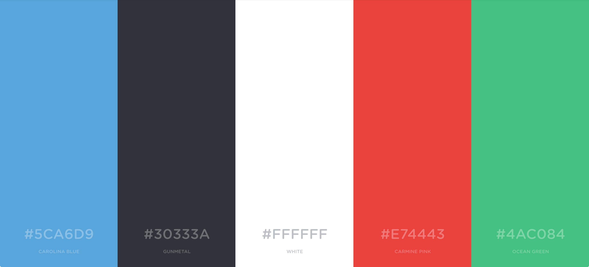
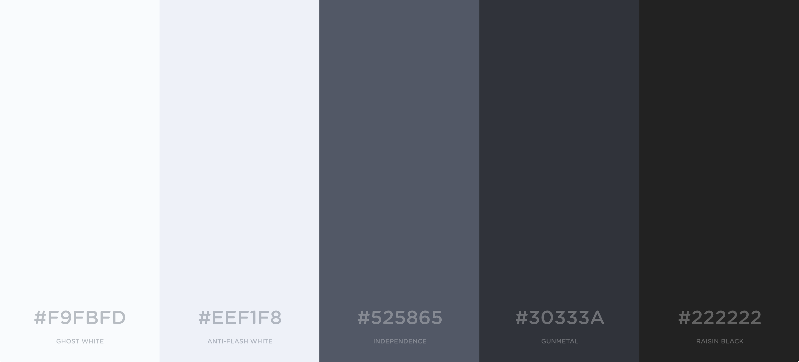

# Einführung
## Zweck

Dieses Dokument beschreibt das Designkonzept von Examibur.

## Gültigkeitsbereich

Der Gültigkeitsbereich beschränkt sich auf die Projektdauer vom 20.02.17 bis 02.06.17. Während dieser Zeit wird das Dokument laufend aktualisiert und stellt zu jedem Zeitpunkt einen genauen Überblick über die Designkonzepte der Benutzerschnittstelle zur Verfügung.

## Referenzen

In der nachfolgenden Tabelle sind alle Dokumente und Links aufgelistet, welche für das Designkonzept von Relevanz sind. Diese Liste wird laufend auf dem aktuellen Stand gehalten.

| **Name**                          | **Referenz**                                                                                                                                                                                                                                         |
| --------------------------------- | ---------------------------------------------------------------------------------------------------------------------------------------------------------------------------------------------------------------------------------------------------- |
| Wireframes                        | [Wireframe Dokumentation](wireframes.html)                                                                                                                         |
| Glossar                           | [Glossar](../projektplan/glossar.html)                                                                                                                                                   |
| Examibur Logo                     | [game-icons.net](http://game-icons.net/delapouite/originals/stabbed-note.html) |
| Farbschema Generator              | [coolors.co](https://coolors.co/)                                                                                                                                                   |
| Bootstrap                     | [getbootstrap.com](http://getbootstrap.com/) |

# Designkonzept

Die nachfolgenden Kapitel dokumentieren alle grösseren Designentscheide von Examibur. Das Design soll grundsätzlich schlicht und unauffällig sein und damit nicht von der Hauptaufgabe, der Prüfungskorrektur, ablenken.

## Farbkonzept

### Basisfarben

Das Farbklima von Examibur stüzt sich auf Weiss und Grau. Diese beiden Farben bilden die primäre Farbwelt. Rot und Grün setzen visuelle Akzente oder können als Signalfarben in der Benutzerführung dienen. Das helle Blau, das ausschliesslich als Logo- und Akzentfarbe eingesetzt wird, rundet die Farbpalette von Examibur ab.

### Grautöne

Um harte Kontraste abzufangen, ergänzen verschiedene Grautöne die Basisfarben. Sie dienen auch der Gestaltung von Bedienelementen und Hintergründen, denn der grossflächige Einsatz der Akzentfarben ist zu vermeiden.

## Bootstrap

Das User Interface wird hauptsächlich in Bootstrap implementiert. Dazu wurde ein [Custom Bootstrap Template](http://getbootstrap.com/customize/) erstellt. Die Konfiguration ist als [JSON-File](resources/bootstrap/config.json) abgelegt.