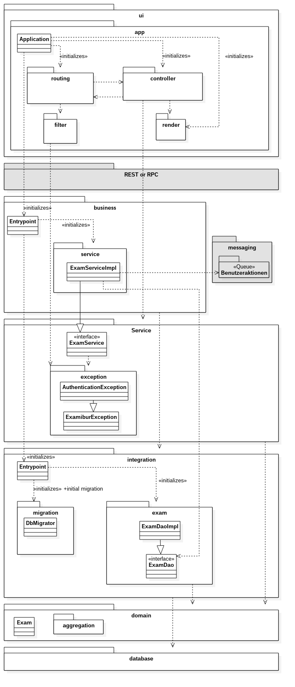
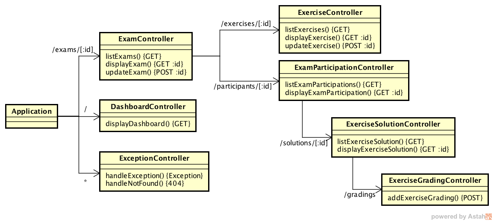
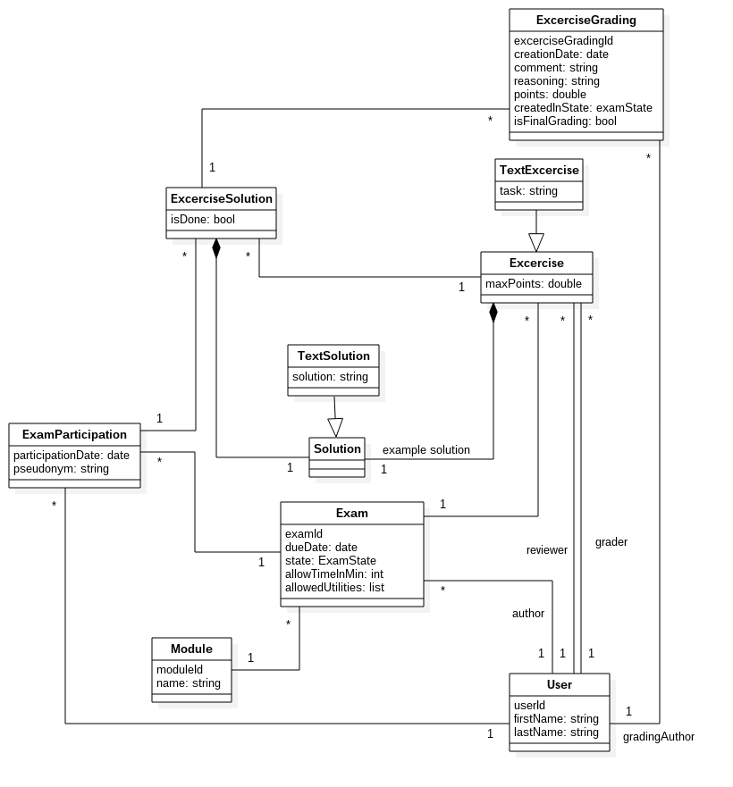
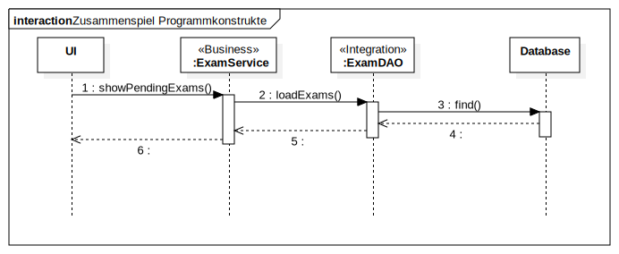
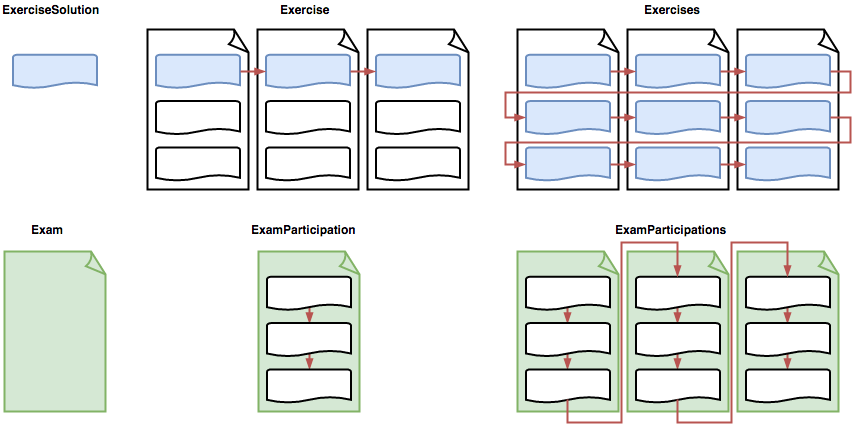

# Einführung
## Zweck

Ziel des Dokuments ist es, dem Leser einen Überblick über den Aufbau der Architektur und die Entscheidungen die dazu geführt haben, zu geben.

## Gültigkeitsbereich

Der Gültigkeitsbereich beschränkt sich auf die Projektdauer vom 20.02.17 bis 02.06.17. Während dieser Zeit wird das Dokument laufend aktualisiert und stellt zu jedem Zeitpunkt einen genauen Überblick über das Projekt zur Verfügung.

## Referenzen

In der nachfolgenden Tabelle sind alle Dokumente und Links aufgelistet, welche für das Projekt von Relevanz sind. Diese Liste wird laufend auf dem aktuellen Stand gehalten.

| **Name**                          | **Referenz**                                                                                                                                                                                                                                         |
| --------------------------------- | ----------------------------- |
| Freemarker                        | [http://freemarker.org/](http://freemarker.org/)  |
| velocity                          | [http://velocity.apache.org/](http://velocity.apache.org/)  |
| Bootstrap                         | [http://getbootstrap.com/](http://getbootstrap.com/) |

# Software Architektur

## Programmkonstruktbildung mit Schichtenmodellbezug

In diesem Abschnitt wird vertiefter in die einzelnen Teile bis auf die Top-Level-Konstrukte eingegangen. Nachfolgend werden die einzelnen Schichten und Konstrukte weiter ausgeführt. **Grau markierte Schichten sind nicht Scope des Projekts und werden weggelassen. So erfolgt der Zugriff des UI direkt auf die Business-Schicht und auf ein Benutzeraktion-Tracking für Auditing-Zwecke wird verzichtet.**

### ui
#### Application

Application ist der zentrale Einstiegspunkt der Spark-Applikation.
Das Routing der Requests auf die einzelnen Controller wird in dieser Schicht durchgeführt.

#### controller
Die clientspezifische Business-Logik ist in dieser Schicht enthalten. So werden unter anderem die Serviceaufrufe auf die Business-Layer abgewickelt.
Dazu gehört auch das Aufbereiten der Daten in die clientinternen Datenmodelle, das Überführen in die zuständigen Views sowie das Abarbeiten von Events. Die Kontroller sind eng mit dem Routing verbunden.
Alle Controller-Methoden müssen Thread-Safe implementiert sein!

#### routing
Enthält die Logik, welche URLs auf welche Controller führen sowie Hilfsklassen zum Erstellen von URLs.

#### renderer
Eine Thread-sichere Rendering-Implementation, welche von den Controllern verwendet wird.

#### filter
Enthält Spark-Filtermethoden, welche die Bearbeitung von Requests in den Controllern vereinfacht.

### REST oder rpc
Diese Schicht agiert als Proxy zwischen der clientspezifischen Business Logik und der Business Schicht. **In einem ersten Schritt wird diese Schicht weggelassen.** Falls die Applikation auf eine verteilte Applikation umgestellt werden muss, sei dies aus Performance- oder Sicherheits-Gründen, kann diese Schicht schnell dazwischen geschaltet werden.

Es würde sich dabei um Proxy-Methoden halten, die die Aufrufe einfach in die Business-Schicht weiterleiten und keine eigene Logik enthalten.

### business
Die Business Logik der eigenen Services und für die Aufbereitung von Daten der Datenbank ist in dieser Schicht enthalten. Die Business-Schicht ist im wesentlichen die effektive Implementation der Service-Schicht.

### messaging
Enthält die Queue für das Tracking der Benutzeraktionen. Jede ausgeführte Aktion erzeugt eine Nachricht, die in diese Queue gestellt wird.

**In einem ersten Schritt wird auf den Einsatz einer Message-Queue verzichtet.**

Lösungen wie ActiveMQ könnten hier in Betracht gezogen werden.

### Service
Beschreibt die Schnittstellendefinition des Business-Layers. Diese Auslagerung ermöglicht es, die Business- und die Darstellungslogik in Zukunft zu trennen.
Alle Service-Methoden müssen Thread-Safe implementiert sein!

#### exception
Definiert eigene Exceptions, welche alle von `ExamiburException` erben. Dies vereinfacht die Service-Schnittstellen und Fehlerbehandlung auf den Clients.

### integration
In dieser Schicht werden die Queries zur Datenbank abgesetzt, in die Domain-Objekte geladen und von den Objekten wieder zurück in die Datenbank geschrieben.

#### migration
In dieser Schicht werden die einzelnen Datenbank-Patches gespeichert. Dies ermöglicht eine automatische Aktualisierung der Datenbank auf dem lokalen Entwicklungssystem und der Produktion während dem Build-Prozess.

### domain
Hier sind die Domain-Objekte enthalten, welche die Datenbanken abbilden. Auf den Domain-Objekten wird auch das objektrelationale Mapping durchgeführt. Für das Mapping wird EclipseLink verwendet.

#### aggregation
Enthält aggregierte Informationen. Grundsätzlich wird das Domain-Model wenn möglich direkt verwendet.

## Design-Entscheide

### Persistenz
Die vom Benutzer und dem System erzeugten Daten werden in einer relationalen Datenbank persistiert.
Das OR-Mapping von der Datenbank zu den Java-Objekten wird anhand des [Datenmodells](#datenmodell) mit EclipseLink umgesetzt.

### Logging-, Error- und Exception-Handling
Das Logging-, Error- und Exception-Handling ist im Kapitel [Error-Handling Policy](../quality/error-handling-policy.html) genauer beschrieben.

## Design der Programmkonstrukte

### Programmkonstrukt UI-Schicht
Die UI-Schicht ist nach dem Thin-Client Ansatz schlank gehalten. Es wird lediglich ein Browser benötigt, um als Client mit Examibur arbeiten zu können.

#### Routing
Am Anfang jeder Interaktion steht der Request. Dieser wird durch den Browser generiert und an Spark versendet. Die in den Controller-Klassen definierten Routing-Regeln weisen den Request einer bestimmten Methode (Controller) zu. Es gewinnt jeweils die erste passende Route. Dennoch wird das gesamte Routing abgearbeitet und erst am Ende die zugewiesene Methode aufgerufen.

<figure>

<figcaption>Die komplette Routing-Logik von Examibur</figcaption>
</figure>

[Spark Documentation - Routes](http://sparkjava.com/documentation.html#routes)

#### Controller
Jeder Controller wird mit einem Request-Objekt aufgerufen, das sämtliche Informationen zum HTTP-Request, wie beispielsweise URL oder Parameter, enthält. Ausserdem wird ein initialisiertes Response-Objekt mitgegeben, über das die Rückgabe zum Client verändert werden kann.

Als erstes werden in einem Controller die Parameter des Requests ausgewertet. Anschliessend werden über Serviceaufrufe auf den Business-Layer Datenzugriffe oder -manipulationen ausgeführt. Am Ende folgt eine Weiterleitung auf eine neue Route oder der Aufruf zur TemplateUtil, welche das Rendern eines Freemarker Templates auslöst.

#### Exception-Handling
Sämtliche Exceptions können im ExceptionController auf einzelne Controller gemappt werden. Sobald eine solche Exception geworfen wird, wird der Routing-Vorgang unterbrochen und die zugewiesene Methode aufgerufen.

[Spark Documentation - Exception Mapping](http://sparkjava.com/documentation.html#exception-mapping)

#### Templates

Die Seitendarstellung wird wie folgt mit Freemarker umgesetzt:
<figure>

<figcaption>Freemarker Übersicht gemäss <a href="http://freemarker.org/">http://freemarker.org/</a></figcaption>
</figure>

Dabei werden die ftl-Templates zusammen mit einem Model in die Freemarker-Engine gespielt und eine HTML-Datei generiert, welche an den User ausgeliefert werden kann. Dies wird über das übliche MVC-Pattern organisiert.

Alle Templates basieren auf einem Basis-Template mit dem Namen `base.ftl`. Dadurch müssen Layout- und Strukturänderungen nur darin gemacht werden.
Design und Layout wird über Cascading Stylesheets (CSS) gesteuert. GUI-Elemente und Styling werden von [Bootstrap](http://getbootstrap.com/) verwendet.
Das applikationsspezifische Styling von Examibur wird im separaten CSS-Dokument `custom.css` definiert und überschreibt die Regeln von Bootstrap automatisch.

Um das User-Feeling zu verbessern, wird teilweise Javascript verwendet.

### Programmkonstrukt Business-Schicht
In der Business-Schicht ist die Geschäftslogik gekapselt.

### Programmkonstrukt Integration-Schicht
Die Integration-Schicht bietet verschiedene Data-Access-Convenience Methoden an, welche den Zugriff auf die Datenbank bündeln und vereinfachen. Diese Methoden sind in sogenannten Data Access Objects (Dao) untergebracht.

### Programmkonstrukt Domain-Schicht
In der Domain-Schicht sind die zu persistierenden Domain-Objekte gekapselt. Darauf wird mit EclipseLink das objektrelationale Mapping zur Datenbank definiert.

#### Datenmodell

### Programmkonstrukt Datenbank-Schicht
In der Datenbank-Schicht werden die Daten in einer relationalen Datenbank gespeichert. Als Datenbankserver wird Postgres verwendet.

## Zusammenspiel der Programmkonstrukte
In diesem Kapitel wird das Zusammenspiel der einzelnen Programmkonstrukte beschrieben. Dazu gehört auch der Zugriff auf die eigenen Datenbank. Das Zusammenspiel wird anhand von UML-Sequenzdiagrammen dargestellt.

Zur Veranschaulichung des Zusammenspiels der Programmkonstrukte wird der Use Case "UC002 Prüfung öffnen" in einem Sequenzdiagram dargestellt.

Um eine möglichst lose Kopplung und hohe Kohäsion in Partitionen zu erreichen wird [Google Guice](https://github.com/google/guice) eingesetzt.

### Zugehörigkeit der Objekte zu den Schichten:
#### UI-Schicht
  * ExamController
  * Template Renderer

#### Business-Schicht
  * Interface: ExamService

#### Integration-Schicht
  * Interface: ExamDao

## Prozesse & Threads

Die Architektur ist so designed, dass möglichst nie ein (globaler) Zustand herrscht (stateless). Die wohl einzige Ausnahme ist das Benutzer-Objekt (siehe nächster Absatz).

Für jeden [Request wird ein Thread aufgemacht](https://blog.krecan.net/2010/05/02/cool-tomcat-is-able-to-handle-more-than-13000-concurrent-connections/), welcher synchron blockierend durchläuft. Dies bedeutet, dass ein Thread bis zur Fertigstellung ("Run-to-completion") durchläuft. Derzeit sind keine asynchronen Operationen vorgesehen.

Sowohl Controller als auch Services müssen Thread-Safe sein, denn sie werden gleichzeitig von mehreren Threads verwendet. Dies sollte meist kein Problem sein, da diese zustandslos sind. 

## Authentisierung / Authorisierung

Bei einem Request steht der aktuelle Benutzer (sofern er angemeldet ist) als `User`-Objekt den Controllern und dem Business-Layer zur Verfügung. Der Zugriff erfolgt aber unterschiedlich:

In UI-Layer wird das Benutzer-Objekt als [Attribut auf dem aktuellen Request](http://sparkjava.com/documentation#request) gesetzt. Da im UI-Layer das Request-Objekt an vielen Orten gebraucht wird macht es Sinn auch gleich dort den Benutzer mitzuliefern.

Im Business-Layer ist der aktuelle Benutzer (des aktuellen Threads) über die statische-Methode `AuthenticationUtil.getCurrentUser()` erreichbar. Die Alternative wäre, dass das Benutzer-Objekt bei jeder Service Methoden mitgegeben würde, was diese unleserlich und unnötig komplex machen würde.

## Korrektur und Review

Korrekturen und Reviews können direkt bei der jeweiligen Aufgabenlösung (ExerciseSolution) erstellt werden. Um den Korrekturvorgang zu erleichtern, gibt es zwei verschiedene Modi, um durch die Aufgabenlösungen zu gehen: Aufgabenweise (erste Zeile in der Abbildung) und Prüfungsweise (zweite Zeile in der Abbildung). Weiter wird unterschieden, ob die Korrektur nach einem Durchgang abbricht oder mit dem nächsthöheren Element fortgesetzt wird (Spalte 2 und 3 der Abbildung).

Während des Korrekturvorgangs wird der URL ein Query-Parameter `browse` angefügt. Der Wert des Parameters bestimmt den Modus: `exercise` (oben Mitte), `exercises` (oben rechts), `participation` (unten Mitte), `participations` (unten rechts).
