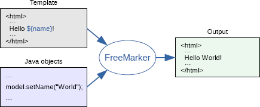

# Einführung
## Zweck

Ziel des Dokuments ist es, dem Leser einen Überblick über den Aufbau der Architektur und die Entscheidungen die dazu geführt haben, zu geben.

## Gültigkeitsbereich

Der Gültigkeitsbereich beschränkt sich auf die Projektdauer vom 20.02.17 bis 02.06.17. Während dieser Zeit wird das Dokument laufend aktualisiert und stellt zu jedem Zeitpunkt einen genauen Überblick über das Projekt zur Verfügung.

## Referenzen

In der nachfolgenden Tabelle sind alle Dokumente und Links aufgelistet, welche für das Projekt von Relevanz sind. Diese Liste wird laufend auf dem aktuellen Stand gehalten.

| **Name**                          | **Referenz**                                                                                                                                                                                                                                         |
| --------------------------------- | ----------------------------- |
| Freemarker                        | [http://freemarker.org/](http://freemarker.org/)  |
| velocity                          | [http://velocity.apache.org/](http://velocity.apache.org/)  |
| Bootstrap                         | [http://getbootstrap.com/](http://getbootstrap.com/) |

# Software Architektur

## Programmkonstruktbildung mit Schichtenmodellbezug

In diesem Abschnitt wird vertiefter in die einzelnen Teile bis auf die Top-Level-Konstrukte eingegangen. Nachfolgend werden die einzelnen Schichten und Konstrukte weiter ausgeführt. **Grau markierte Schichten sind nicht Scope des Projekts und werden weggelassen. So erfolgt der Zugriff des UI direkt auf die Business-Schicht und auf ein Benutzeraktion-Tracking für Auditing-Zwecke wird verzichtet.**

### ui
#### Application

Application ist der zentrale Einstiegspunkt der Spark-Applikation.
Das Routing der Requests auf die einzelnen Controller wird in dieser Schicht durchgeführt.

#### webapp
In dieser Partition sind die dargestellten Elemente enthalten, sowie de Resourcen (Bilder, JavaScript) und die Konfiguration der Webapplikation.

Dazu gehören Freemarker-Templates und die Stylesheet Layout Definitionen.

#### controller
Die clientspezifische Business-Logik ist in dieser Schicht enthalten. So werden unter anderem die Serviceaufrufe auf die Business-Layer abgewickelt.
Dazu gehört auch das Aufbereiten der Daten in die clientinternen Datenmodelle, das Überführen in die zuständigen Views sowie das Abarbeiten von Events.

#### model
Enthält View-Models um das Rendering auf dem Client zu vereinfachen. Grundsätzlich wird das Domain-Model wann möglich direkt verwendet.

#### util
Darin sind Hilfsklassen enthalten, die eine spezifische Funktionalität kapseln, wie zum Beispiel i18n, Konvertierung, Formatierung, Validierung, Exception Handling, etc..

### service
Diese Schicht agiert als Proxy zwischen der clientspezifischen Business Logik und der Business Schicht. **In einem ersten Schritt wird diese Schicht weggelassen.** Falls die Applikation auf eine verteilte Applikation umgestellt werden muss, sei dies aus Performance- oder Sicherheits-Gründen, kann diese Schicht schnell dazwischen geschaltet werden.

Es würde sich dabei um Proxy-Methoden halten, die die Aufrufe einfach in die Business-Schicht weiterleiten und keine eigene Logik enthalten.

### business
Die Business Logik der eigenen Services und für die Aufbereitung von Daten der Datenbank ist in dieser Schicht enthalten.

### messaging
Enthält die Queue für das Tracking der Benutzeraktionen. Jede ausgeführte Aktion erzeugt eine Nachricht, die in diese Queue gestellt wird.

**In einem ersten Schritt wird auf den Einsatz einer Message-Queue verzichtet.**

Lösungen wie ActiveMQ könnten hier in Betracht gezogen werden.

### integration
In dieser Schicht werden die Queries zur Datenbank abgesetzt, in die Domain-Objekte geladen und von den Objekten wieder zurück in die Datenbank geschrieben.

#### migration 
In dieser Schicht werden die einzelnen Datenbank-Patches gespeichert. Dies ermöglicht eine automatische Aktualisierung der Datenbank auf dem lokalen Entwicklungssystem und der Produktion während dem Build-Prozess.

### domain
Hier sind die Domain-Objekte enthalten, welche die Datenbanken abbilden. Auf den Domain-Objekten wird auch das objektrelationale Mapping durchgeführt. Für das Mapping wird EclipseLink verwendet.

## Design-Entscheide

### Persistenz
Die vom Benutzer und dem System erzeugten Daten werden in einer relationalen Datenbank persistiert.
Das OR-Mapping von der Datenbank zu den Java-Objekten wird anhand des [Datenmodells](#datenmodell) mit EclipseLink umgesetzt.

### Logging-, Error- und Exception-Handling
Das Logging-, Error- und Exception-Handling ist im Kapitel [Error-Handling Policy](../projektplan/error-handling-policy.html) genauer beschrieben.

### Frontend Framework
Für das Frontend wurden die Frameworks *Spring Boot*, *Play* und *Spark* in Betracht gezogen. Nachfolgend werden einige Vor- und Nachteile der einzelnen Frameworks, bezogen auf unser Projekt, aufgelistet. Anschliessend wird ein Framework für unser Projekt ausgewählt.

#### Spring Boot
 Vorteile                               | Nachteile
----------------------------------------|--------------------------------
 Etabliertes Framework für Web-Projekte | Sehr umfangreich und komplex
 Viele Funktionen out-of-the-box oder gut integriert mit anderen Lösungen | Niemand vom Projektteam hat Erfahrung mit Spring
 Mit Spring Boot Starters schnell up-and-running | Dadurch aber nur schwer durchschaubar (Convention over Configuration)
  Grosse Community |

#### Play Framework
Vorteile                                | Nachteile
----------------------------------------|--------------------------------
Schlanker als Spring | Stark auf Scala konzipiert
Grosse und stetig wachsende Community | Niemand vom Projektteam hat Erfahrung mit Play
- | Wenig unterstützung für weitere Funktionalität, z.B. LDAP Integration

#### Spark
Vorteile                                | Nachteile
----------------------------------------|--------------------------------
Sehr schlankes Framework | Wenig Funktionalität out-of-the-box
Einfach zu verstehende Konzepte | Für Testing, Template-Engine usw. müssen weitere Frameworks benutzt werden
Unterstützung für viele andere Frameworks | Architektur muss selbst sauber aufgebaut werden

### Entscheid
Aufgrund der Einfachheit und der Möglichkeit, sich schnell in das Framework einarbeiten zu können, haben wir uns für **Spark** entschieden. Für unsere Anforderungen genügt ein schlankes Framework, das wir mit u.a. Testing-Frameworks und OR-Mapper beliebig erweitern können.

Als Einschränkung soll beachtet werden, dass z.B. die Routes und Controller in der Dokumentation von Spark nicht sauber getrennt sind. Diese Trennung muss selbst realisiert werden und ist wichtig für den Aufbau der Architektur.

### Backend
> TODO

### Template-Engine
Für die Seitenbeschreibung wird das Konzept der Templates von Freemarker verwendet. Es gibt ein Basis-Template, welches das Layout und die Strukturierung vorgibt. Alle Seiten der Applikation bauen auf diesem Basis-Template auf. Dadurch ist gewährleistet, dass alle Seiten mit der gleichen Struktur und einheitlichem Aussehen daher kommen.

Zur Auswahl standen [Velocity](http://velocity.apache.org/) und [Freemarker](http://freemarker.org/), welche beide von Spark empfohlen werden.
Der Entscheid fiel auf Freemarker, weil Velocity seit 2010 keine neue Version nachgeliefert hat und wir so davon ausgehen, dass es in naher Zukunft eingestellt werden könnte.

## Design der Programmkonstrukte

### Programmkonstrukt UI-Schicht
Die UI-Schicht ist nach dem Thin-Client Ansatz schlank gehalten. Es wird lediglich ein Browser benötigt, um als Client mit Examibur arbeiten zu können.

#### Routing
Am Anfang jeder Interaktion steht der Request. Dieser wird durch den Browser generiert und an Spark versendet. Die in den Controller-Klassen definierten Routing-Regeln weisen den Request einer bestimmten Controller-Methode zu. Es gewinnt jeweils die erste passende Route, dennoch wird das gesamte Routing abgearbeitet und erst am Ende die zugewiesene Methode aufgerufen.

<figure>

<figcaption>Die komplette Routing-Logik von Examibur</figcaption>
</figure>

#### Controller
Jeder Controller wird mit einem Request-Objekt aufgerufen, das sämtliche Informationen zum HTTP-Request, wie beispielsweise URL oder Parameter, enthält. Ausserdem wird ein initialisiertes Response-Objekt mitgegeben, über das die Rückgabe zum Client verändert werden kann.

Als erstes werden in einem Controller die Parameter des Requests ausgewertet. Anschliessend werden über Serviceaufrufe auf den Business-Layer Datenzugriffe oder -manipulationen ausgeführt. Am Ende folgt eine Weiterleitung auf eine neue Route oder der Aufruf zur TemplateUtil, welche das Rendern eines Freemarker Templates auslöst.

#### Templates

Die Seitendarstellung wird wie folgt mit Freemarker umgesetzt:
<figure>

<figcaption>Freemarker Übersicht gemäss <a href="http://freemarker.org/">http://freemarker.org/</a></figcaption>
</figure>

Dabei werden die ftl-Templates zusammen mit einem Model in die Freemarker-Engine gespielt und eine HTML-Datei generiert, welche an den User ausgeliefert werden kann. Dies wird über das übliche MVC-Pattern organisiert.

Alle Templates basieren auf einem Basis-Template mit dem Namen `base.ftl`. Dadurch müssen Layout- und Strukturänderungen nur darin gemacht werden.
Design und Layout wird über Cascading Stylesheets (CSS) gesteuert. GUI-Elemente und Styling werden von [Bootstrap](http://getbootstrap.com/) verwendet.
Das Styling wird auf das CI von Examibur gemappt, welches im `style.css` gemacht werden kann.

Um das User-Feeling zu verbessern, wird teilweise Javascript verwendet.

#### Utilities

Im Package "util" sind Klassen abgelegt, die verschiedene Funktionalität abdecken. Nachfolgend sind die verwendeten Funktionalitäten aufgeführt:
> TODO hier laufend UTIL-Klassen kurz beschreiben

  * **TemplateUtil** enthält Methoden, um die Templates zu rendern
  * **DateUtil** enthält Methoden für die Formatierung von Datumswerten
  * **FormatUtil** enthält allgemeine Formatierungsmethoden
  * **MessageUtil** enthält Methoden für das Laden von sprachabhängigen Texten

Die sprachabhängigen Texte sind in den Language-Files unter `src/main/resources` abelegt. Pro Sprache wird eine Datei abgelegt.

### Programmkonstrukt Business-Schicht
In der Business-Schicht ist die Geschäftslogik gekapselt.

### Programmkonstrukt Integration-Schicht
Die Integration-Schicht bietet verschiedene Data-Access-Convenience Methoden an, welche den Zugriff auf die Datenbank bündeln und vereinfachen. Diese Methoden sind in sogenannten Data Access Objects (Dao) untergebracht.

### Programmkonstrukt Domain-Schicht
In der Domain-Schicht sind die zu persistierenden Domain-Objekte gekapselt. Darauf wird mit EclipseLink das objektrelationale Mapping zur Datenbank definiert.

#### Datenmodell
>  TODO Robin

### Programmkonstrukt Datenbank-Schicht
In der Datenbank-Schicht werden die Daten in einer relationalen Datenbank gespeichert. Als Datenbankserver wird Postgres verwendet.

## Zusammenspiel der Programmkonstrukte
In diesem Kapitel wird das Zusammenspiel der einzelnen Programmkonstrukte beschrieben. Dazu gehört auch der Zugriff auf die eigenen Datenbank. Das Zusammenspiel wird anhand von UML-Sequenzdiagrammen dargestellt.

Zur Veranschaulichung des Zusammenspiels der Programmkonstrukte wird der Use Case "UC001 Prüfungen angezeigen" in einem Sequenzdiagram dargestellt.

> TODO dieses Diagram muss angepasst werden, sobald klar ist, wie das Routing und Controller im Spark ablaufen.

### Zugehörigkeit der Objekte zu den Schichten:
#### UI-Schicht
  * html: Dashboard

#### Business-Schicht
  * Interface: ExamService

#### Integration-Schicht
  * Interface: ExamDao

## Exception-Handling im Web-Teil
> TODO

## Physisches Datenmodell
> TODO Datenmodell mit FK etc.
