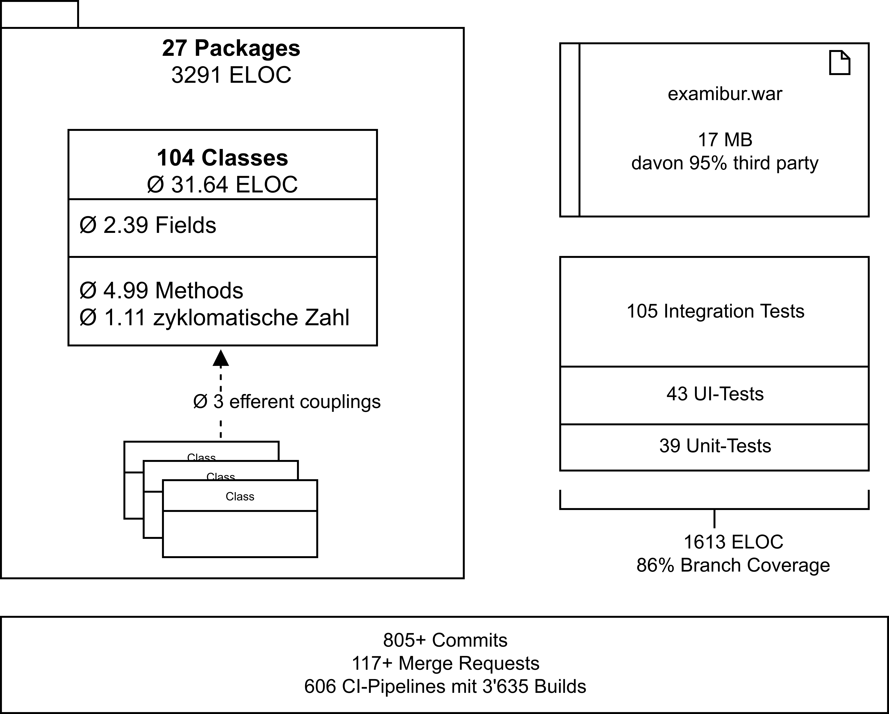
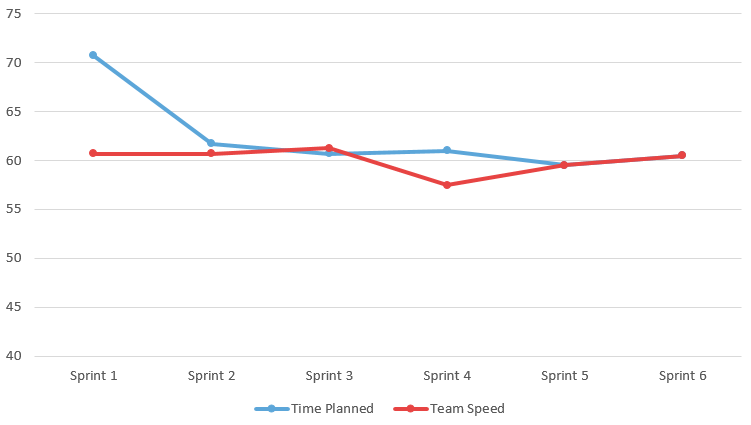
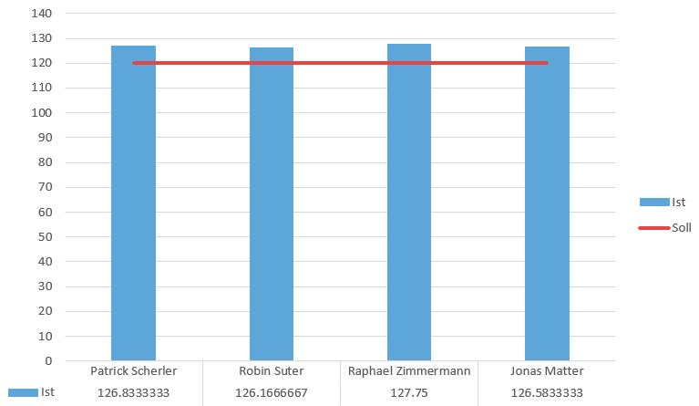
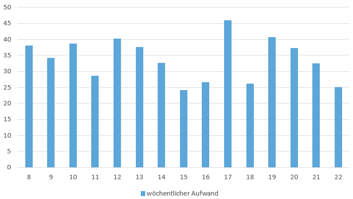

# Einführung
## Zweck

Ziel des Dokuments ist es, dem Leser einen Überblick über die Durchführung und das Ergebnis des Projekts Examibur zu geben.

## Gültigkeitsbereich

Der Gültigkeitsbereich beschränkt sich auf die Projektdauer vom 20.02.17 bis 02.06.17. 

## Referenzen

In der nachfolgenden Tabelle sind alle Dokumente und Links aufgelistet, welche für das Dokument von Relevanz sind. Diese Liste wird laufend auf dem aktuellen Stand gehalten.

| **Name**       | **Referenz**                                                                                                                                |
| -------------- | ------------------------------------------------------------------------------------------------------------------------------------------- |
| Zeitauswertung | [Link](./Examibur_Auswertung.xlsx)                                                                                                         |
| offene Issues  | [Gitlab Issues](https://gitlab.com/engineering-projekt/examibur/issues?scope=all&utf8=%E2%9C%93&state=opened&milestone_title=Folgeprojekt) |

# Zielerreichung
| **Use Case**                             | **Erreicht / Nicht erreicht** |
| ---------------------------------------- | ----------------------------- |
| Prüfung anzeigen / öffnen                | Erreicht                      |
| Prüfungsteilnahme / -aufgabe korrigieren | Erreicht                      |
| Prüfung für Review freigeben             | Erreicht                      |
| Review abarbeiten                        | Erreicht                      |
| Prüfungskorrektur abschliessen           | Erreicht                      |
| Notenskala festlegen                     | Nicht Erreicht                |
| Prüfung auswerten                        | Erreicht                      |
| Prüfung auf Modulebene auswerten         | Nicht Erreicht                |
| ToDo’s anzeigen                          | Erreicht                      |
| Review abschliessen                      | Erreicht                      |
| Prüfungsteilnahme / -aufgabe reviewen    | Erreicht                      |
| Online Prüfungseinsicht für Studenten    | Nicht Erreicht                |

Die meisten Use Cases konnten wir erfolgreich implementieren. Der Use Case “Notenskala festlegen” wurde im UI nicht implementiert, aber im Code mit einem Strategy Pattern so implementiert, dass dieses Feature einfach umgesetzt werden könnte. “Prüfung auf Modulebene auswerten” haben wir nicht implementiert, wohl aber die allgemeine Auswertung einer Prüfung.

Während der Umsetzung und beim Usability-Test sind Verbesserungsvorschläge und Ideen entstanden, die nicht mehr in einen Sprint gepasst haben. Diese sind als [offene Issues](https://gitlab.com/engineering-projekt/examibur/issues?scope=all&utf8=%E2%9C%93&state=opened&milestone_title=Folgeprojekt) im Gitlab erfasst.

## Nicht-funktionale Anforderungen
Die nicht-funktionalen Anforderungen, die direkt mit der Implementation zu tun haben, sind grösstenteils erfüllt. Bezüglich der Sicherheit wurden einige Anforderungen nicht komplett erfüllt. So ist keine allgemeine Autorisierung implementiert, die einen User daran hindert, Prüfungen aufzurufen, zu denen er keine Berechtigung hat. Dies haben wir vernachlässigt, um uns auf die Funktionalität konzentrieren zu können.

## Metriken
Zusammenfassend haben wir eine Übersicht von Metriken erstellt. Herauszuheben sind insbesondere die durchschnittliche zyklomatische Zahl, die grosse Anzahl CI-Builds und die vielen Integration Tests.

# Zeitauswertung

Die Verwaltung der Arbeitszeit wurde mit Hilfe von Gitlab direkt auf den Issues durchgeführt. Aufgrund von Kinderkrankheiten von Gitlab sind Auswertungen direkt auf der Plattform nicht möglich und müssen von Hand auf Exports durchgeführt werden. In den nachfolgenden Kapiteln wird der Aufwand aufgeschlüsselt und genauer analysiert.

## Velocity

Zu Projektbeginn haben wir uns darauf geeinigt, dass wir im Sprint 1 ein wenig mehr als die verfügbare Arbeitszeit von 69 Stunden einplanen. Im nächsten Sprint sind wir dann aufgrund der abgeschlossenen Issues bei einem Team Speed von 60 gelandet. Wir haben also Issues im Wert von 10 Stunden im ersten Sprint nicht umsetzen können. Wenn man nun den Verlauf über die 7 Sprints betrachtet, sieht man, dass er sich bei diesem Wert relativ schnell eingependelt hat.

**Was hat es nun aber mit der Abweichung im Sprint 4 auf sich?** 
Die Abweichung war ein Planungsfehler. Beim Sprint Planing wurden die Abwesenheitseinträge nicht vorgängig angeschaut und so kam es, dass ein Teammitglied die geplante Arbeitszeit in diesem Sprint nicht einhalten konnte, welche dann im nächsten Sprint kompensiert wurde.

Es lässt sich nun darüber streiten, ob es ein richtiger Ansatz ist, wenn man den geschätzten und den tatsächlichen Aufwand nicht vergleicht und in die Berechnung miteinbezieht. Aber wenn man es utopisch betrachtet, arbeitet jeder Entwickler seine vorgeschriebene Arbeitszeit und nicht mehr, und durch die Stabilität in der geschätzten Zeit und dem Team Speed haben wir im Team ein gutes Gefühl beim Sprint Planing.

## Aufwand pro Person

Wie man dem Diagramm entnehmen kann, haben sich die Arbeitszeiten bei allen Mitgliedern grösstenteils bei 130 Stunden eingependelt. Das ist sicher darauf zurückzuführen, dass wir eine fixe Anzahl an Stunden eingeplant haben, welche wir gemeinsam in einem Zimmer am Projekt gearbeitet haben. Die Überzeit von je etwa 10 Studenten über 15 Wochen betrachtet ist für uns kein kritischer Faktor und kann vernachlässigt werden.

## Aufwand pro Woche

Vorgesehen war ein wöchentlicher Aufwand von 34.4 Stunden. Die Sprints waren auf zwei Wochen ausgelegt, was einem Aufwand von 68.8 Stunden pro Sprint entspricht.  Die Teammitglieder waren in einem Sprint frei in der Gestaltung ihrer Arbeitszeit. Es war egal, ob die Arbeit in einer Woche oder über zwei Wochen verteilt geleistet wurde. Dies verdeutlicht sich, wenn man den Mittelwert berechnet, welcher sich bei 34 Stunden hält. Weiter lassen sich die Schwankungen durch individuelle Belastungen der einzelnen Teammitglieder durch parallel laufende Projekte und Feiertage erklären.  

# Allgemeiner Erfahrungsbericht
## Organisation und Kommunikation

Während des gesamten Semesters war das ganze Team motiviert und engagiert am Projekt beteiligt. Bestimmt haben auch die gemeinsamen Mittagessen und Gipfeli-Pausen zur Motivation und Teambildung beigetragen.

Die Kommunikation im Team hat sehr gut funktioniert. Der wohl wichtigste Grund dafür waren die zwei Vormittage, welche wir exklusiv für die Projektarbeit eingeplant haben. So konnten nicht nur wichtige Entscheide im Team gefällt werden, sondern auch technische Herausforderungen direkt mit den Kollegen besprochen werden.

Alle Teammitglieder hatten ein gewisses Spezialgebiet, wo sie ihre persönlichen Erfahrungen und Präferenzen ausspielen konnten. Diese waren aber dank Code Reviews und Arbeitsteilung keine Monopole.

Die Kommunikation bei Merge-Request Reviews war nicht immer einfach, da in dieser Form der Kritik die nonverbalen Aspekte fehlen. Sehr hilfreich war es immer, die Kritikpunkte direkt in den reservierten Stunden für die Projektarbeit zu besprechen, um so die Ursachen der Kritik zu verstehen und eine Ideale Lösung zu finden.

## Meetings

An den zwei reservierten Vormittagen fanden jeweils ein Daily Standup und alle zwei Wochen das Sprint Planing statt.

Insgesamt zweimal haben wir eine Retrospektive durchgeführt, um über die vergangenen Projektwochen zu reflektieren und unsere Lehren daraus zu ziehen. Dazu gehört beispielsweise, dass das Infrastruktur-Thema unterschätzt wurde oder bei der Arbeitszeiterfassung oft nachgehakt werden musste. Ebenfalls blieben Merge Requests jeweils lange unbearbeitet, was dazu führte, dass Issues dementsprechend lange offen blieben und der Merge-Prozess aufwändiger wurde.

Wir haben auch einen Gipfeli-Tag eingeführt, an dem jedes Teammitglied Gipfeli mitbrachte. Dieses Ritual war uns sehr wichtig.

## Technologien

Wir sehen das Engineering Projekt als Chance, mit neue Technologien und Ideen zu experimentieren. Diese Chance haben wir auf allen Ebenen des Projekts umgesetzt, was sich aber auch als viel Arbeit herausstellte.

Wir haben uns früh gegen ein grosses Framework wie Spring entschieden, um eine elegante, schlanke Lösung mit Micro-Frameworks zu erreichen. Dadurch haben wir einerseits Einarbeitungszeit in die komplexen Frameworks vermieden, andererseits mussten wir dafür viele Herausforderungen moderner Webapplikationen selber lösen und implementieren (Bsp. Routing). Die Befürchtung, dass ein Framework uns zu sehr im Weg steht, trifft in gewissem Masse somit auch für Micro-Frameworks zu. Das Projekt Examibur ist auch kein Micro-Projekt, für das beispielsweise Spark gebaut wurde.

Bei der Infrastruktur und der Entwicklungsumgebung haben wir mit Docker experimentiert. Diese Technologie ist leider in einem so kleinen Umfang relativ Aufwändig zu betreiben, da viele manuelle Schritte (Backup, Deployment, etc.) benötigt werden.

Für das Projektmanagement haben wir mit Gitlab ein uns allen unbekanntes Produkt eingesetzt. Gitlab bietet sehr viele Funktionen, von Code-Reviews mit Merge-Requests über Zeiterfassung bis hin zu Continuous Integration, die meist auch sehr gut funktionieren. Ein Mangel an API-Funktionalität zur Extraktion der Zeitlogs, sowie ein sehr instabiles Hosting zehrte aber an useren Nerven.

Obwohl wir die Kosten dieser Technologien unterschätzt haben, hat sich der Aufwand gelohnt. Wir konnten so positive und auch negative Erfahrungen sammeln, die uns bei der Verwendung von einem “klassischen” Java-Stack (Jira, Jenkins, Shellscripte, etc.) entgangen wären.

## Herausforderungen / Probleme

### UI Testing
Eine Herausforderung, die wir relativ schnell im Projekt bemerkten, ist die Testbarkeit des UI-Layers. Mit den Integration Tests haben wir vom Service-Interface aus alle Layer durchtesten können. Dies deckte bereits einen Grossteil des Codes ab, da wir im Business-Layer relativ wenig Logik brauchten. Ebenfalls konnten wir gerade unsere Test-Daten nutzen, die wir zuvor erstellt hatten.

Für den UI-Layer allerdings sind Unit-Tests nicht mehr trivial. Wir besprachen Möglichkeiten, unsere (Spark)-Controller mit simulierten Requests zu testen und die UI-Darstellung zu abstrahieren, so dass dessen Logik getestet werden konnte.

Stattdessen haben wir uns entschieden, die UI-Tests mit einem Selenium-gesteuerten Browser und Screenshots zu realisieren. Dafür wird mit Docker eine komplette Instanz unserer Applikation hinaufgefahren und mit Selenium darauf navigiert. Dann wird jeweils ein Screenshot gemacht und mit einem Referenz-Screenshot verglichen, der im Source-Verzeichnis liegt. Wenn etwas nicht übereinstimmt, wird ein Differenz-Bild erstellt.
Dies ermöglichte es, sehr schlanken Test-Code zu schreiben und die Darstellung im Browser konsistent zu halten. Hatte sich etwas verändert, wurde dies sofort sichtbar und musste von Hand als “korrekt" übernommen werden, wenn die Veränderung beabsichtigt war.

Damit die Test-Automatisierung systemunabhängig war und es keine Probleme mit verschiedenen Bildschirm-Auflösung gab, liessen wir die Tests komplett in Docker-Containern laufen, zusammen mit Selenium Hub. Bedauerlicherweise gelang die Ausführung in der Continous Integration nicht, da es dort Probleme mit dem Erstellen von Screenshots gab.

### Gitlab Infrastruktur
Über das ganze Projekt hinweg hatten wir mit regelmässigen Ausfällen von Gitlab zu kämpfen. Es gab oft ungeplante Unterbrüche bei Wartungsarbeiten ihrerseits. Da Gitlab zwar Möglichkeiten bietet, Zeit auf Issues zu buchen, dabei aber keine Auswertung erstellt, haben wir mithilfe der Export-Funktion jeweils das ganze Projekt exportiert und dabei selbst eine rudimentäre Zeitauswertung erstellt. Leider gab es genau bei dieser Export-Funktion oft Probleme, wodurch wir manchmal für längere Zeit weder Backups erstellen, noch eine aktuelle Zeitauswertung generieren konnten.

## Kosten

Ein interessantes Gedankenspiel wäre, eine realistische Kostenschätzung für unseren Proof-of-Concept zu berechnen. Wir sind von den 56 Personentagen (420 Arbeitsstunden) in einem 4er-Team und den 21.75 Arbeitstagen ausgegangen, welche die Gerichte in Zürich für die Arbeitszeitbrechung vorgeben. Als massgebende Zahl, um die Kosten zu berechnen, werden 15’000 CHF Aufwand für einen Personenmonat verrechnet.

| Personentage         | 56                                      |
| -------------------- | --------------------------------------- |
| Arbeitstage im Monat | 21.75                                   |
| Kosten Personentag   | ca. 690 CHF (15’000 CHF/Personenmonat*) |
| **Kosten**           | **38’640 CHF**                          |

**SE2 aufwandschaetzung.pdf, F45, Dr. Daniel Keller*

Die Kosten von 38’640 CHF für den aktuellen Stand des Projekts sind nach unserer Ansicht gerechtfertigt.

## Fazit

Den grössten Nutzen, welchen wir als Team aus den 14 Wochen Examibur ziehen, ist das Wissen, welches wir durch den Start auf der grünen Wiese gewinnen konnten. Die ganze Organisation und Aufgleisung des Projekts hat einige graue Haare, aber auch viele Erfahrungen beschert. 

Um die Spielwiese des Engineering-Projekts richtig auszunutzen, haben wie auf Technologien und Dienste gesetzt, welche noch in Kinderschuhen stecken. Dazu gehörte beispielsweise der Einsatz von Gitlab als Issue Tracker und Repository. Gitlab bietet einige Vorzüge, wie die Abhandlung von Reviews, aber auch recht viele Hürden. Die ständigen Probleme mit der Verfügbarkeit und dem wenig ausgereiften Zeitmanagementtool von Gitlab hat dazu geführt, dass wir in nächster Zeit keine Projekte mehr mit Gitlab angehen würden. Wir sind der Ansicht, dass der Einsatz von bewährten Mitteln wie Spring, Github, Travis etc. zu einer höheren Produktivität geführt hätte.

Während dieser Zeit wurde uns wieder aufgezeigt, wie wichtig die Inception- und Elaboration-Phasen sind. Die Abgleichung der Vorstellung aller Stakeholder braucht Zeit und Kraft. Da die Vision von Examibur sehr gross angelegt ist, war es wichtig, einen sauberen Scope abzustecken. Im Nachhinein wurde der Wunsch nach einem zusätzlichen Elaboration-Sprint laut, um zusätzliche Variantenvergleiche durchführen zu können, um so fundiertere Entscheide bezüglich der Architektur und Einsatz von Technologien zu fällen.

Abschliessend ist zu sagen, dass das Projekt persönlich für die Teammitglieder ein Erfolg auf allen Ebenen ist und den weiteren Verlauf des Studiums prägen wird.

# Persönliche Erfahrungen
## Robin Suter

Dieses Projekt war für mich eine sehr spannende Erfahrung, da ich zum ersten Mal mein gelerntes Wissen über Software Engineering in einem praktischen Projekt von A-Z anwenden konnte. Als Team haben wir sehr gut harmoniert und es hat jeder seinen entscheidenden Teil beigetragen.

Besonders spannend war der Umstand, dass wir bewusst kein grosses Framework gewählt haben, sondern vieles selbst von Grund auf selbst bauten. Besonders beim Tooling konnten wir so spannende Ansätze ausprobieren, die wir bestimmt in anderen Projekten wiederverwenden können. Dieser minimalistischer Ansatz machte das Projekt auch herausfordernd. Ich hätte mir eine längere Elaboration-Phase gewünscht, damit wir mehrere Ansätze und Architekturen hätten ausprobieren können.

Im Nachhinein habe ich gemerkt, dass die Prozesse in unserer Applikation schnell deutlich komplexer werden können, als ich das mir anfangs vorgestellt hatte. Ich merkte auch eindrücklich, wie bestimmte Prinzipien wie das “Broken Windows Problem” zwar trivial erscheinen, aber schnell an mehreren Stellen zu schlechtem Code führen können. Bei uns war das glücklicherweise fast nie ein Problem, da wir mit gegenseitigen Code-Reviews die Code-Qualität hoch halten konnten.

Die Architektur zeigte mir auch etwas die Nachteile von relationalen Datenbanken und strikten Layern. So haben wir viele “Durchlauferhitzer” auf der Business- und Integrations-Schicht, die vielleicht mit einem anderen Ansatz wie NoSQL einfacher und eleganter gelöst werden könnten. Oft führten auch Details auf der UI-Ebene dazu, dass mit einem einzelnen User-Request viele Daten aus der Datenbank nachgeladen werden mussten.

Insgesamt war das Projekt für mich ein grosser Lernerfolg, sowohl in praktischem Software-Engineering, als auch in Sachen Projekt-Management und die Zusammenarbeit im Team.

## Raphael Zimmermann

Auch nach über 120 spannenden und aufregenden Stunden Projektarbeit bin ich nach wie vor von der Idee einer modernden Prüfungsplattform überzeugt. Wie so oft sieht man, je tiefer man in eine Thematik eintaucht, deren Komplexität klarer.  So ist Examibur heute leider noch lange nicht das, was es sein sollte. Dafür hat uns die Zeit klar gefehlt.

Ich hatte viel Spass während dem gesamten Projekt. Es war für mich eine Möglichkeit, viele neue Technologien wie Docker, Guice und Spark in einem realistischen Kontext einzusetzen und zu testen. Dabei musste ich lernen, dass auch kleine Frameworks hohe Kosten haben und ich würde heute nicht nochmals den gleichen Stack wählen.

Als das interessanteste am Projekt empfand ich es, Themen und Konzepte aus anderen Modulen (insbesondere Parallele Programmierung, Verteilte Softwaresysteme, Software Engineering 2 und Datenbanksysteme 2) im Kontext von Examibur durchzudenken und zu überlegen, ob es Sinn machen würde, diese zu verwenden.

Als grosse Herausforderung empfand ich es, den geeigneten Umfang für Dokumente zu finden. Die Entscheidung, alle Dokumente als lebendige Website anstelle von verstaubten Word-Dokumenten zu pflegen, welche mit jedem Merge-Request anzupassen sind, halte ich für eine der besten Entscheide unserer Projektarbeit.

Auch das Finden und Erstellen von geeigneten und konsistenten Testdaten habe ich punkto Aufwand stark unterschätzt. Auch die Übersicht über diese Daten zu behalten ist schwierig ( Beispielsweise, die Frage “Welcher Lehrer hat eine Prüfung in welchem Stadium?”).

Ein überraschendes Highlight waren die Usability Tests. Der Input war äusserst konstruktiv und hilfreich und während ich diese früher eher als luxuriösen Zusatz gesehen habe, halte ich sie heute für entscheidend für ein gutes Produkt.

## Jonas Matter

Die Idee von Raphael Zimmermann, den Prüfungsprozess an der Hochschule transparent und greifbar zu machen, hat mich begeistert. Der Umstand, dass man nach einer durchgeführten Prüfung nicht auf einfachem Weg sieht, was man besser machen könnte, hat mich zusätzlich für das Projekt motiviert. 

Die Zusammenstellung des Teams war ideal. Durch vorgängige Zusammenarbeiten mit allen Teammitgliedern war von Anfang an klar, worauf man sich einlässt und wo die Skills verteilt sind. 

Die persönlichen Lehren, welche ich aus dem Projekt ziehen kann, beziehen sich vor allem auf das Projektmanagement und um die Prozesse, welche nicht direkt mit Programmieren zu tun haben. Dazu gehörte die Aufgleisung des Projekts und das konkrete Requirement Engineering, welches ich in dieser Form noch nie durchführen konnte. Die Diskussionen darüber, was jetzt für einen Proof of Concept notwendig ist, waren hart aber lehrreich. Zufrieden gestimmt haben mich die Iterationen über die Architektur. Zu sehen, wie sich diese weiterentwickelt und bewährtes aufgrund von neu auftauchenden Problemen wieder verworfen wird, war eindrücklich.

Die Planung des Projekts und der einzelnen Phasen war ein kleiner Gipfel, welcher bezwungen werden musste. Rückblickend kann man sagen, dass wir mit den zweiwöchigen Sprints und der Wochenaufteilung auf die verschiedenen Phasen gut gefahren sind. Natürlich hätte ich mir einen weiteren Evaluation- und Construction-Sprint gewünscht, um ausgiebigere Variantenvergleiche durchführen und noch weitere MVP-relevante Use Cases umsetzen zu können.

Durch das Engineering Projekt gewann ich einen völlig neuen Blick auf die Projektorganisation und gehe mit einer anderen Einstellung an künftige Projekte.

## Patrick Scherler

Dies war für mich das erste Softwareprojekt dieser Länge, bei dem so intensiv zusammengearbeitet wurde. Ich denke am meisten profitieren konnte ich darum von unserem Git-Workflow, den Code-Reviews, Scrum-Meetings und den ausgiebigen Architekturdiskussionen.

Während des Projekts konnte ich auch die „Broken-Windows-Theorie“ aus der SE2-Vorlesung eindrücklich miterleben. Da wir von Anfang an viel Wert auf sauberen Code legten und jeden Merge Request mit kritischem Code Review abschlossen, versuchte niemand, die pragmatische Lösung der sauberen vorzuziehen.

Da der gewählte Technologie-Stack für uns alle neu war, gestaltete sich die Einarbeitungszeit länger als gedacht. Dem sollte Spark, als schlankes Microframework, eigentlich entgegenwirken. Es fehlten jedoch viele Grundfunktionalitäten, welche von uns selbst durchdacht und implementiert werden mussten. So wurden die meisten Use Cases erst in den letzten Sprints relativ dicht beieinander umgesetzt.

Eine positive Überraschung kurz vor Projektende waren die Usability Tests. Es zeigte sich, dass man eigene Gedankengänge und in einem Team erarbeitete Abläufe schnell als selbstverständlich erachtet.

Aus persönlicher und lehrreicher Sicht würde ich dieses Projekt auf jeden Fall als erfolgreich bezeichnen. Wie es mit Examibur nun weitergeht, wird sich hoffentlich noch zeigen.

