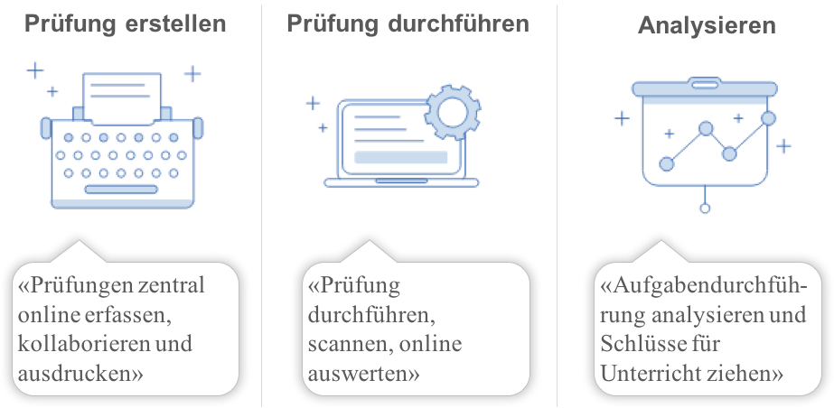
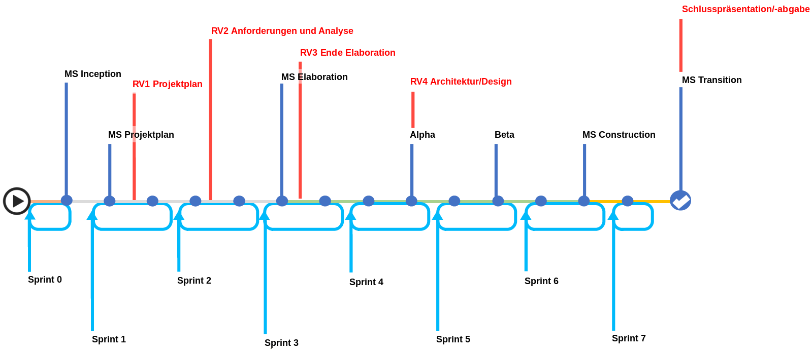
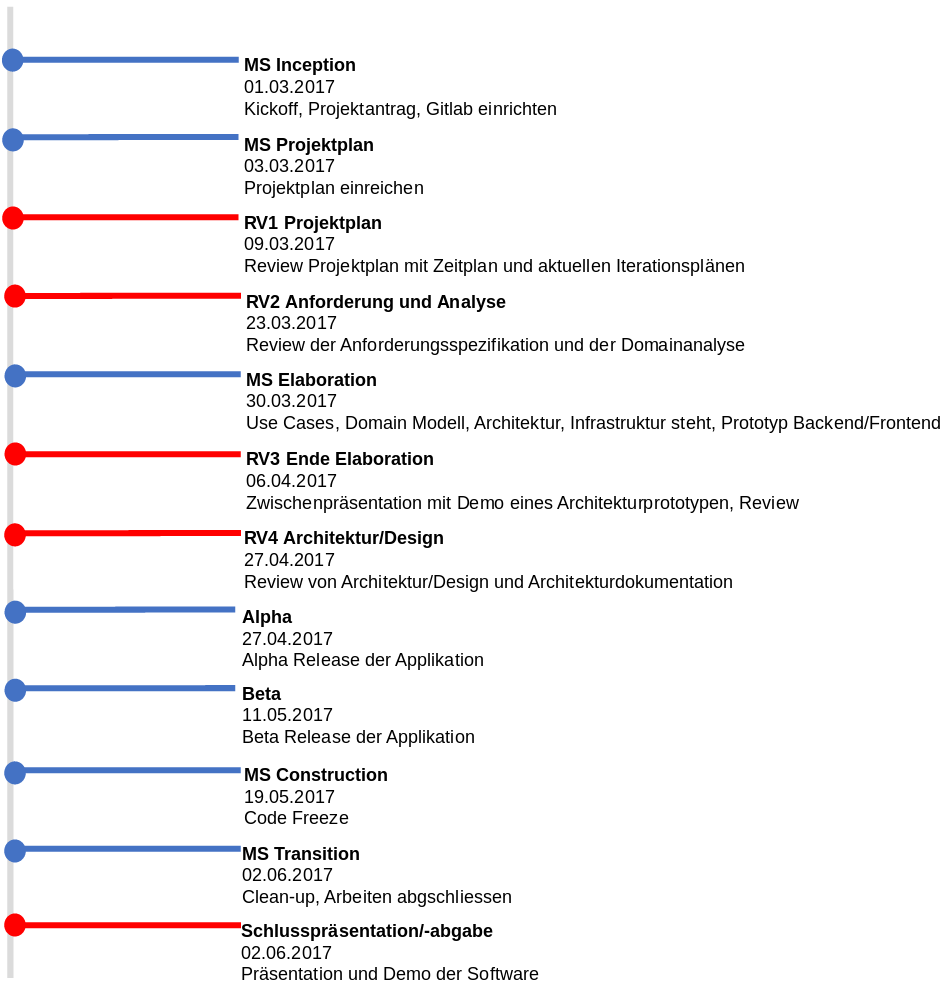

# Einführung
## Zweck

Ziel des Dokuments ist es, dem Leser einen Überblick über das Projekt Examibur zu geben und so einen schnellen Einstieg in den Projektablauf zur gewähren.  Dabei wird der Projektablauf aufgeschlüsselt, die möglichen Risiken analysiert, einen Überblick über die Arbeitsweise, die Infrastruktur und die Qualitätssicherung gegeben.

## Gültigkeitsbereich

Der Gültigkeitsbereich beschränkt sich auf die Projektdauer vom 20.02.17 bis 02.06.17. Während dieser Zeit wird das Dokument laufend aktualisiert und stellt zu jedem Zeitpunkt einen genauen Überblick über das Projekt zur Verfügung.

## Referenzen

In der nachfolgenden Tabelle sind alle Dokumente und Links aufgelistet, welche für das Projekt von Relevanz sind. Diese Liste wird laufend auf dem aktuellen Stand gehalten.

| **Name**                          | **Referenz**                                                                                                                                                                                                                                         |
| --------------------------------- | ---------------------------------------------------------------------------------------------------------------------------------------------------------------------------------------------------------------------------------------------------- |
| Projektantrag                     | [Projektantrag.docx](../projektantrag/Projektantrag_EPJ_Examibur.docx) |
| Risikomanagement                  | [TechnischeRisiken.xlsx](../projektplan/TechnischeRisiken.xlsx)                                                                                                                         |
| Glossar                           | [Glossar](glossar.html)                                                                                                                                                   |
| Arbeitspakte / Zeiterfassung      | [Issue im Gitlab](https://gitlab.com/engineering-projekt/examibur/issues?scope=all&sort=due_date_asc&state=opened)                                                                                                                                                                                                                                                                                                  |
| Scrum Board                       | [Sprint 1](https://gitlab.com/engineering-projekt/examibur/boards/268063)                                                                                                                                                                            |
| Termine                           | [Google Calendar](https://calendar.google.com/calendar/embed?src=l232n5a38terjn899fvf7fom88%40group.calendar.google.com&ctz=Europe/Zurich)                                                                                                           |
| Continuous Integration            | [Gitlab CI](https://gitlab.com/engineering-projekt/examibur/graphs/master/ci)                                                                                                                                                                        |
| Check Style                       | [Google Checkstyle](http://google.github.io/styleguide/javaguide.html)                                                                                                                                                                                                    |
| Die 3 Säulen von Examibur - Icons | [Von symu.co](https://symu.co/freebies/icons-0/elpis-icon-set-1/)                                                                                                                                                                                                   |
| Examibur Logo                     | [Von game-icons.net](http://game-icons.net/delapouite/originals/stabbed-note.html) |

# Projekt Übersicht

Das Ziel ist es, ein Gesamtsystem für die Prüfungserstellung, -durchführung, -korrektur und –auswertung zu entwickeln. Der Dozent hat die Möglichkeit, bereits während des Semesters Prüfungsaufgaben zu erfassen. Am Semesterende kann daraus eine Gesamtprüfung zusammen gestellt werden. Die Prüfung kann einerseits online oder klassisch auf Papier durchgeführt werden. Dabei werden die ausgefüllten Prüfungen am Ende eingescannt und den jeweiligen Studenten zugeordnet. Zur Korrektur werden die Prüfungen Aufgabenweise korrigiert und anschliessend automatisch ausgewertet. Dadurch erhält der Dozent wertvolle Daten, die für eine Qualitätsverbesserung genutzt werden können. Die Prüfungsteilnehmer können anschliessend Einsicht in die Prüfungskorrektur erhalten.

## Die 3 Säulen von Examibur

## Zweck und Ziel

### Sinn und Zweck & Zielsetzung
Der Prüfungsprozess an der HSR hat sich in den letzten Jahrzehnten kaum verändert. Prüfungen werden nach wie vor auf Papier durchgeführt, die Korrektur und Noteneintragung erfolgen manuell von Hand.

Für Dozierende ist der Aufwand, die Prüfungen zu korrigieren und zu benoten Zeitaufwändig.  Es passieren schnell Fehler beim Abtippen und Zusammenzählen von Punktezahlen und der manuellen Übertragung in bspw. ADUNIS. Eine Analyse der Prüfung, beispielsweise wie gut welche Aufgaben gelöst wurden, um kommende Moduldurchführungen zu verbessern, ist zu aufwändig und wird deshalb wohl meist weggelassen. Diese Daten sind selbstverständlich auch für die Schulleitung und die Qualitätsbeauftragten der HSR von fundamentalem Interesse.

Auch für die Studierenden wäre eine Zusammenfassung dieser Resultate eine Hilfe, um die eigene Leistung einordnen zu können. So wird die Prüfungseinsicht von vielen Studenten nicht wahrgenommen, da diese persönlich vor Ort zu erfolgen hat und die Notenschlüssel und Bewertungskriterien oft nicht klar ersichtlich sind.

Unsere Vision eines Prüfungssystems ist es, dass Prüfungen online (oder bei Bedarf auf Papier) durchgeführt und anschliessend von den Dozierenden bequem online korrigiert und nachgeprüft werden können. Ein solches System könnte die oben genannten Probleme stark vereinfachen oder ganz lösen.

Um das Potential unserer Lösung zu demonstrieren, möchten wir das Kernstück der Applikation als Prototyp umsetzen, um eine Grundlage für die Digitalisierung der Prüfungsprozesse an Hochschulen zu schaffen.

### Persönliche Ziele
Im Engineering Projekt haben wir die Möglichkeit, einen komplett eigenen Softwarestack für die Planung und Durchführung eines Softwareprojekts zu verwenden. Im Gegensatz zu unseren Erfahrungen in der Privatwirtschaft ist noch keine existierende Infrastruktur vorhanden. Im Rahmen dieses Projekts möchten wir Gitlab als Engineering-Werkzeug evaluieren.

Keines der Teammitglieder hat Erfahrungen mit dem weit verbreiteten Spring-Framework. Unser Ziel ist es, gut fundierte Kenntnisse für die Erstellung von Spring Webapplikationen mit Datenbankanbindung zu erarbeiten.

Wir möchten uns die Kenntnisse aneignen, wie eine Java-Webapplikation mit Docker entwickelt wird und für die Produktion vorbereitet werden kann.

## Lieferumfang

### Abgabe
Am Endes des Projekts wird eine CD mit folgendem Inhalt abgeliefert:

- Source-Code (Repository) mit aktuellem Build
- Installations- und Konfigurationsanleitung
- Benutzeranleitung
- Projekt-Dokumentation
- Gitlab Export mit Projekt-Management-Daten
- Sonar Export mit Screenshots
- Schlusspräsentation
- Testdaten und -Auswertung

### Scope
Der Projektumfang wird eingeschränkt auf den Prozess der Prüfungskorrektur mit Auswertung. Wir gehen davon aus, dass die Prüfungen bereits in maschinenlesbarer Form vorliegen, es wird explizit kein Import oder Export realisiert.
Wenn noch zusätzlich Zeit bleibt, wird eine Funktion zur Bearbeitung von Rekursen angestrebt.

## Annahmen und Einschränkungen

In der Planung des Projekts wird davon ausgegangen, dass die Abschlusspräsentation am Ende der letzten Projektwoche (Semesterwoche 15) stattfindet. Wir rechnen nicht mit einem längeren Ausfall durch z.B. Krankheit oder Unfall von Projektmitarbeitern.

Als Endprodukt wird ein lauffähiger Proof-of-Concept angestrebt, der als Demonstration für einen potentiellen Kunden dienen kann (Minimal Viable Product). Der Zeitaufwand des Projekts ist begrenzt auf 14 Projektwochen mit 120 Arbeitsstunden pro Person.
Die Infrastruktur der lokalen Entwicklungsumgebung wird nur mit Docker realisiert, wenn damit auch eine effiziente Entwicklung möglich ist.

# Projektorganisation
## Organisationsstruktur

Unser Projektteam ist in einer flachen Hierarchie organisiert. Dies ermöglicht eine direkte und effiziente Kommunikation. Um eine möglichst gute Verteilung des Know-hows zu erlangen, erhält jedes Projektmitglied Einsicht und Mitsprache in alle Bereiche der Arbeit. Es werden jedoch auch klare Verantwortungen in Form von Ressorts zugeteilt, um eine Qualitätssicherung zu gewährleisten.

<table>
<tr>
<td><b>Jonas Matter</b> Projektmanagement, Scrum-Master</td>
<td><b>Patrick Scherler</b> User Interface, Dokumentation</td>
</tr>
<tr>
<td><b>Robin Suter</b> Datenbanken, Qualitätsverantwortlicher</td>
<td><b>Raphael Zimmermann</b> Infrastruktur, Protokollführer</td>
</tr>
</table>
Die detaillierte Aufteilung der Kompetenzen ist im folgenden Funktionsdiagramm ersichtlich:

|                        | **Jonas Matter** | **Patrick Scherler** | **Robin Suter** | **Raphael Zimmermann** | **Extern** |
| ---------------------- | ---------------- | -------------------- | --------------- | ---------------------- | ---------- |
| **Projektmanagement**  | P / E / A        | M                    | M               | M / K                  | M          |
| **Scrum**              | P / E / A        | M                    | M / K           | M                      | M          |
| **Qualitätssicherung** | M                | M                    | P / E / A       | M                      | M          |
| **Infrastruktur**      | M / K            | M                    | M               | P / E / A              | M          |
| **Protokoll**          | M                | M / K                | M               | P / E / A              | M          |
| **User Interface**     | M / K            | P / E / A            | M               | M                      | M          |
| **Datenbank**          | M                | M / K                | P / E / A       | M                      | M          |
| **Entwicklung**        | P / E / A / K    | P / E / A / K        | P / E / A / K   | P / E / A / K          | M          |
| **Dokumentation**      | E / A / K        | P / E / A / K        | E / A / K       | E / A / K              | M          |

P: Planen, M: Mitsprache, E: Entscheiden, A: Ausführen, K: Kontrollieren

## Externe Schnittstellen

Folgende externe Schnittstellen wurden für unser Projekt definiert:

- **Dr.** **Daniel Keller**: Betreuer, Beratung und Kontrolle

# Management Abläufe
## Kostenvoranschlag

Das Projekt wurde mit dem Kickoff am 20.02.2017 gestartet und wird spätestens am 02.06.2017 abgeschlossen. Während dieser Zeit stehen 4 Teammitglieder mit je 120 Arbeitsstunden zur Verfügung. Pro Woche sind je Mitarbeiter 8.6 Stunden für das Projekt vorgesehen.

<table>
<tr>
<td>Kickoff</td>
<td>20.02.2017</td>
</tr>
<tr>
<td>Projektabschluss</td>
<td>02.06.2017</td>
</tr>
<tr>
<td>Projektdauer</td>
<td>14 (15) Wochen (mit Ferien/Feiertagen)</td>
</tr>
<tr>
<td>Teammitglieder</td>
<td>4</td>
</tr>
<tr>
<td>Arbeitsstundenbudget</td>
<td>480 Stunden</td>
</tr>
</table>

Neben denn unterrichtsfreien Tage der HSR und den öffentlichen Feiertagen sind keine Absenzen geplant. Durch die Flexibilität der Teammitglieder und die kurz angelegten Sprints (2 Wochen) ist bei kurzfristigen Absenzen eine rasche Umdisponierung und Neuplanung möglich.

## Zeitliche Planung

Die Arbeitspakte und die Zeit wird mithilfe von Gitlab verwaltet. Zu allen Tätigkeiten werden Issues erfasst und den korrespondierenden Kategorien zu geordnet. Der Verfasser eines Issues gibt bei der Erfassung eine provisorische Schätzung an. Diese wird bei der Sprint Planung durch die Einschätzung aller Teammitglieder verfeinert. Der eigentliche Aufwand kann direkt auf dem Issue verbucht werden. So ist jederzeit eine Auswertung möglich, wer wie lange was gemacht hat und wie dies mit der Einschätzung übereinstimmt.

### Phasen / Iterationen
Das Projekt wird in 6 Sprints mit einer Dauer von je 2 Wochen und einem Abschlusssprint von einer Woche aufgeteilt. Der zusätzliche Sprint 0 ist für die Setup-Phase und Projektfindung angedacht und somit kein eigentlicher Scrum-Sprint.

### Meilensteine

## Besprechungen

Das Team findet jeweils Donnerstags von 10.00 bis 12.00 Uhr und Freitags von 08.00 bis 11.30 Uhr in den Räumlichkeiten der HSR zusammen. Während dieser Zeit sind Daily-Standups von 10 Minuten und Sprint-Plannings alle zwei Wochen mit einer Dauer von je 2 Stunden geplant.

Die Daily-Standups sind zur Klärung folgender Fragen da:

- Was habe ich seit dem letzten Treffen gemacht?
- Wo sind Probleme aufgetreten?
- Was werde ich bis zum nächsten Treffen machen?

Die Sprint-Plannings ermöglichen eine saubere Planung der Arbeitspakete für die nächsten zwei Wochen und eine genaue Schätzung dieser.

Um die Produktivität zu erhöhen und das Arbeitsklima auf einem hohen Stand zu halten, findet man alle drei Wochen am Freitag von 11.00 bis 12.00 Uhr zu einer Retrospektive zusammen, um über die vergangenen Tage zusprechen und um allfällige Prozesse und Mittel zu optimieren.

Dadurch entsteht mit Ausnahme der Reviews und Beratungssitzungen ein Gesamtaufwand von 80.5 Stunden für Besprechungen. Geplante Besprechungen werden ebenfalls als Issues aufgenommen und im Sprint Planning für den jeweiligen Sprint eingeplant.

### Meetings mit Betreuer
Zu den obenstehenden Zeitpunkten werden in unregelmässigen Abständen Reviews und allfällige Beratungssitzungen mit Herr Keller im Raum 1.171 stattfinden.

### Protokollführung
Offene Punkte, welche während den Besprechungen auftreten, werden direkt im Anschluss durch den Protokollführer als Issues mit einer Deadline versehen, im Gitlab erfasst. Zudem werden diese mit einem eindeutigen Label versehen, welches die Besprechung identifiziert, um so zu jedem Zeitpunkt eine Aussage über den Stand der offenen Punkte zu geben.

# Risikomanagement
## Risiken

Eine Liste mit den wahrscheinlichsten technischen Risiken des Projekts ist im separaten Excel-Dokument [**TechnischeRisiken.xlsx**](https://gitlab.com/engineering-projekt/examibur/raw/master/docs/projektplan/TechnischeRisiken.xlsx) definiert.

Das Hauptrisiko des Projekts stellt die umfangreiche Gesamtlösung unserer Arbeit dar, welche durch die Prüfungsprozesse der HSR gegeben ist. Deswegen haben wir einen eindeutigen Scope definiert und klar formuliert, dass wir einen Prototyp für eine eventuelle Machbarkeitsstudie implementieren und noch keine einsatzfähige Gesamtlösung, um die bisherigen Prozesse zu ersetzen. Nichtsdestotrotz sollte der Prototyp am Ende lauffähig sein und eine aufschlussreiche Präsentation bieten können.

## Umgang mit Risiken

Beim Schätzen der User-Stories wird jeweils eine entsprechende Reserve eingeplant, falls diese von einem oder mehreren der oben definierten Risiken betroffen sind.

Am Ende jeder Iteration wird eine Risikobeurteilung durchgeführt. Beim Eintreten eines Risikos wird die vordefinierte Massnahme umgesetzt und die Situation neu beurteilt. Sollte dadurch der Projektzeitplan (Meilensteine) in Verzug kommen, wird auch dieser neu beurteilt und entsprechende Massnahmen eingeleitet.

# Arbeitspakete

Die Arbeitspakete, Meilensteine und Sprints werden auf gitlab.com verwaltet.

<table>
<tr>
<td>Projekt-URL</td>
<td><a href="https://gitlab.com/engineering-projekt/examibur/issues/">https://gitlab.com/engineering-projekt/examibur/issues/</a></td>
</tr>
<tr>
<td>Zugangsdaten</td>
<td>Die Zugangsdaten werden dem Dozent direkt per E-Mail zugeteilt.</td>
</tr>
</table>

# Infrastruktur

Übersicht der Infrastruktur: Einige Komponenten zur Übersicht wurden bewusst weggelassen

## Entwicklungsumgebung

### Workstation Entwickler

Jedes Projektmitglied arbeitet auf seinem persönlichen Laptop. Die Entwicklungsumgebung ist grundsätzlich Plattformunabhängig, die Projektmitglieder arbeiten aber primär mit Linux und OS X. Auf allen Geräten ist folgende Software installiert:

- OpenJDK >= 1.8.0_121
- Gradle == 3.3
- Eclipse Neon.2 (4.6.X)
  - Gemeinsamen Einstellungen für Plug-Ins werden Dokumentiert
    - Eclipse Formatter
    - Checkstyle Plugin
    - FindBugs
- Git >= 2.x
- pandoc >= 1.19
- python >= 3.5
- Docker >= 1.12
- Docker-Compose  >= 1.11
- Star-UML  (Evaluation Version) >= 2.8.0
- Inkscape  >= 0.92
- Editor nach Wahl für Dokumentation in Markdown, Beispielsweise Vim, MacDown

Eventuelle UI/Usability-Tests werden auf den privaten Geräten der Projektmitglieder durchgeführt.

### Online Dienste

- Dropbox-Paper für kollaborativer Kickoff von Dokumenten
- Mockups auf https://hsrui.mybalsamiq.com

### Gitlab.com

- Privates Projekt auf https://gitlab.com
- Versionskontrolle mit Git
- Changemanagement mit Gitlab Issues
- Arbeitszeit mit Gitlab Issues
- Releasemanagement mit Gitlab CI
- Buildmanagement mit Gitlab CI

###  Projekteserver
- Demo Instanz der Applikation
- SonarQube Instanz
- Bei Bedarf: Gitlab CI Worker

### Kommunikation

- Primär über Tickets und Kommentare auf Gitlab.com
- Bilaterale Kommunikation und Sitzungen
- Unverbindliche und schnelle Kommunikation über den WhatsApp-Chat “EPJ”
- E-Mail über die Infrastruktur der HSR

### Räumlichkeiten

- Donnerstag 10:00-12:00: Zimmer 1.271
- Freitag 08:00-11:30: Zimmer 8.U01
- Falls die Zimmer ausnahmsweise besetzt sind wird kurzfristig eine alternative gesucht und über WhatsApp kommuniziert.

### Weiteres

Für allfällige Papier-Ausdrucke wird die Infrastruktur der HSR verwendet.

## Backup-Konzept

Für Backups der persönlichen Laptops ist jedes Projektmitglied selbst verantwortlich. Regelmässige Backups von Gitlab.com und dem Projekte Server werden mindestens drei Mal wöchentlich von Raphael Zimmermann ausgelöst, gesichert und verifiziert.
Auf dem Projekteserver laufen alle Applikationen in Docker-Container. Alle Container werden jede Nacht heruntergefahren, ein Backup aller Volumes in Form eines Tar-Archivs erstellt und anschliessend die Container wieder neu gestartet.

# Qualitätsmassnahmen

Um während dem Projekt eine möglichst hohe Qualität zu gewährleisten, werden folgende Massnahmen getroffen:

| **Massnahme**                           | **Zeitraum**        | **Ziel**                                                                |
| --------------------------------------- | ------------------- | ----------------------------------------------------------------------- |
| **Dokumentation als statische Website** | Fortlaufend         | Saubere Versionierung der Dokumentation, übersichtlicher Einstiegspunkt |
| **Code Reviews**                        | Für jede User-Story | Verbesserung der allgemeinen Code-Qualität                              |
| **Code Metriken**                       | Fortlaufend         | Überwachung der Code-Qualität                                           |
| **Code CheckStyle**                     | Fortlaufend         | Einhaltung des Code-Styles                                              |
| **Automatisierte Tests**                | Fortlaufend         | Fehlereliminierung und verfrühte Fehler-Erkennung                        |

## Dokumentation

Die Dokumentation wird im Markdown-Format geschrieben und im Git-Repository abgelegt. So ist die gesamte Projektdokumentation an einem Ort und im Text-Format versioniert.
Für die Abgabe einzelner Dokumente werden diese in PDFs und Word-Dokumente umgewandelt.

Mithilfe von Gitlab Pages wird von der Dokumentation eine statische Website mit einer Übersichtsseite erstellt. Das Generieren der HTML-Pages wird in die Continuous Integration Pipeline eingebaut.

## Projektmanagement

Für das Projektmanagement wird [Gitlab](https://gitlab.com) verwendet. Jedes Arbeitspaket wird im Code-Repository als ein Issue erfasst. Die Projekt-Meilensteine und die einzelnen Sprints werden in Gitlab als Milestones geführt.
Zur Übersicht werden Labels für die verschiedenen Kategorien von Arbeitspaketen verwendet. Jedem Issue wird dabei ein Milestone und ein oder mehrere Labels zugeordnet.

Für den Betreuer wird nach Absprache ein Gast-Zugang für das Gitlab-Projekt eingerichtet.

### Sprint-Planung
In Gitlab wird für jeden Sprint ein Scrum-Board geführt. Dabei werden alle Issues für den Sprint in die Spalten “Planned”, “In Progress”, “Review” und “Done” eingeordnet.

### Definition of Done
Ein Issue wird abgeschlossen, wenn folgende Bedingungen erfüllt sind:

- Funktionalität gemäss Abnahmekriterien im Issue implementiert
- Der Code ist sinnvoll kommentiert
- Es sind keine Warnungen oder Fehler von CheckStyle und FindBugs vorhanden
  - Sinnvolle Ausnahmen sind im Code mit Suppress-Annotations versehen, begründet und vom Reviewer akzeptiert
- Review über einen Merge Request ist erfolgt und vom Reviewer genehmigt
- Merge Request ist abgeschlossen (in master branch gemerged)
- Dokumentationen sind angepasst
- Unit und Integration Tests sind vorhanden und laufen erfolgreich durch
- Build in Continuous Integration Prozess läuft erfolgreich durch
- Zeitabrechnung in Gitlab-Issue wurde nachgeführt

## Entwicklung

Der Source Code wird mit Git verwaltet und ist im Repository auf Gitlab abgelegt. Das Projekt ist unter https://gitlab.com/engineering-projekt/examibur (privater Zugang) erreichbar.

### Entwicklungs-Workflow

Während der Construction-Phase wird der Master-Branch gesperrt, sodass dieser nur noch über Merge Requests bearbeitet werden kann.
Für jede User-Story wird ein eigener Branch erstellt. Nach der Implementation wird ein Merge Request erstellt und ein Reviewer zugewiesen. Ist der Code Review und allfällige Änderungen erfolgt, wird der Feature-Branch in den Master-Branch gemerged.

### Code Style
Als Code Style (Checkstyle) wird der [Google Java Style Guide](http://google.github.io/styleguide/javaguide.html) verwendet.
In der Entwicklungsumgebung (Eclipse) wird ein Checkstyle Plugin installiert, um den Code Style während der Entwicklung laufend zu überprüfen. Zusätzlich wird mit dem FindBugs-Plugin, das statische Code-Analysen durchführt, die Codequalität weiter verbessert.

### Code Metriken
Um während der Entwicklung laufend die Code-Qualität zu überwachen, wird auf dem Projekteserver Sonar Qube installiert.

Für die Test-Coverage wird neben dem Report in Sonar Qube in der lokalen Entwicklungsumgebung das JaCoCo-Plugin eingebunden, das während dem Gradle-Build einen Report generiert.

## Testen

Während der Entwicklung werden laufend mit den Feature-Implementationen Tests geschrieben.
Die Tests werden in der lokalen Entwicklungsumgebung ausgeführt, die möglichst nahe an der Produktionsumgebung ist. Sie werden ausserdem in den Continuous Integration-Prozess eingebunden.

### Unit Testing
Unit Tests mit JUnit werden laufend während der Entwicklung geschrieben und mindestens vor jedem Commit ausgeführt.

### Integration Testing
Für jeden Use Case wird nach der Implementierung ein Integration Test geschrieben. Die Ergebnisse werden dokumentiert.
