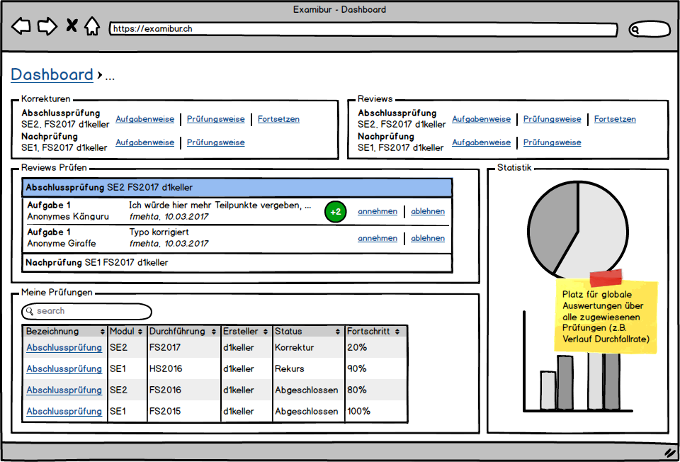
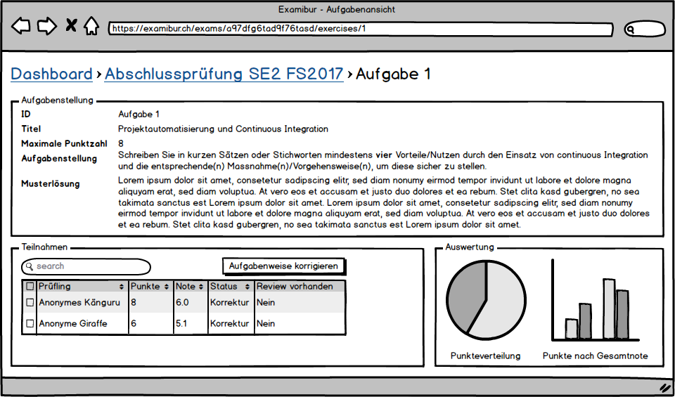
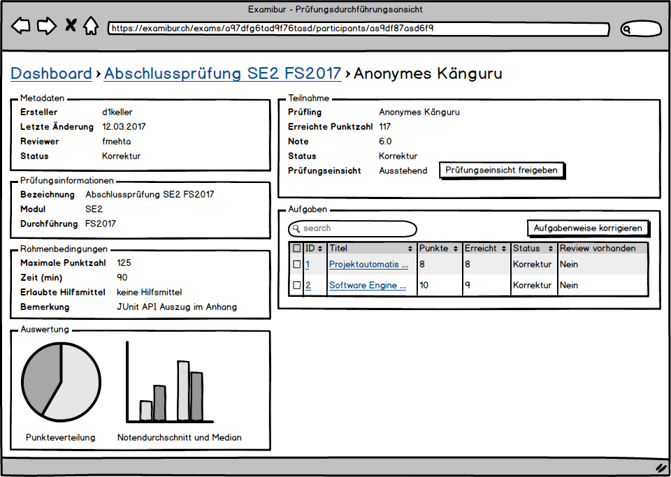
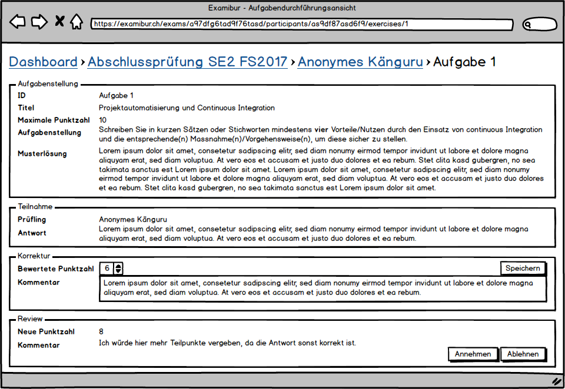

# Einführung
## Zweck

Dieses Dokument beschreibt die Wireframes des späteren User Interface Designs. Die funktionalen Anforderungen dienen als Vorlage der aufgeführten Wireframes.

## Gültigkeitsbereich

Der Gültigkeitsbereich beschränkt sich auf die Projektdauer vom 20.02.17 bis 02.06.17. Während dieser Zeit wird das Dokument laufend aktualisiert und stellt zu jedem Zeitpunkt einen genauen Überblick über die Wireframes zur Verfügung.

## Referenzen

In der nachfolgenden Tabelle sind alle Dokumente und Links aufgelistet, welche für die Wireframes von Relevanz sind. Diese Liste wird laufend auf dem aktuellen Stand gehalten.

| **Name**                          | **Referenz**                                                                                                                                                                                                                                         |
| --------------------------------- | ---------------------------------------------------------------------------------------------------------------------------------------------------------------------------------------------------------------------------------------------------- |
| Anforderungsspezifikation         | [Anforderungsspezifikation](https://gitlab.com/engineering-projekt/examibur/raw/master/docs/anforderungen/anforderungsspezifikation.md)                                                                                                                         |
| Glossar                           | [Glossar](https://gitlab.com/engineering-projekt/examibur/blob/master/docs/projektplan/glossar.md)                                                                                                                                                   |
| Wireframe Tool                    | [myBalsamiq.com](https://www.mybalsamiq.com/)                                                                                                                                                   |

# Wireframes

Die nachfolgenden Wireframes bilden die Grundlage für das spätere User zuInterface Design. Die entsprechenden Use Cases einer Ansicht sind jeweils verlinkt und falls nötig mit einer schrittweisen Anleitung ergänzt.

Die Wireframes wurden mit der Webversion von [Balsamiq Mockup](https://www.mybalsamiq.com/) erstellt. Eine interaktive Ausführung kann unter [www.mybalsamiq.com](https://hsrui.mybalsamiq.com/projects/ejpscherler/prototype/Dashboard?key=df3843320eedb3d97be9b37aaf74e0ac4421ddc1) gestartet werden.

## Dashboard
Use Cases:

* UC001: Prüfungen anzeigen
* UC002: Prüfung öffnen
* UC019: ToDo's anzeigen

## Prüfungsansicht
Use Cases:

* UC003: Prüfungsteilnahmen anzeigen
* UC004: Prüfungsaufgaben anzeigen (teilweise)
* UC005: Teilnahme Prüfungsweise korrigieren
* UC006: Teilnahme Aufgabenweise korrigieren
* UC008: Prüfung für Review freigeben
* UC011: Teilnahme Prüfungsweise reviewen
* UC012: Teilnahme Aufgabenweise reviewen
* UC014: Review abschliessen
* UC016: Prüfungskorrektur abschliessen
* UC017: Notenskala festlegen
* UC018: Prüfung auswerten
* UC022: Notenexport durchführen
* UC023: Prüfung auf Modulebene auswerten

## Aufgabenansicht
Use Cases:

* UC004: Prüfungsaufgaben anzeigen (Einzelansicht)
* UC006: Teilnahme Aufgabenweise korrigieren
* UC012: Teilnahme Aufgabenweise reviewen

## Prüfungsdurchführungsansicht
Use Cases:

* UC006: Teilnahme Aufgabenweise korrigieren
* (UC021: Prüfungsteilnahme an Student freigeben)
* UC113: online Prüfungseinsicht für Studenten

## Aufgabendurchführungsansicht
Use Cases:

* UC007: Aufgabe korrigieren
* UC009: Review abarbeiten
* UC013: Aufgabe reviewen

